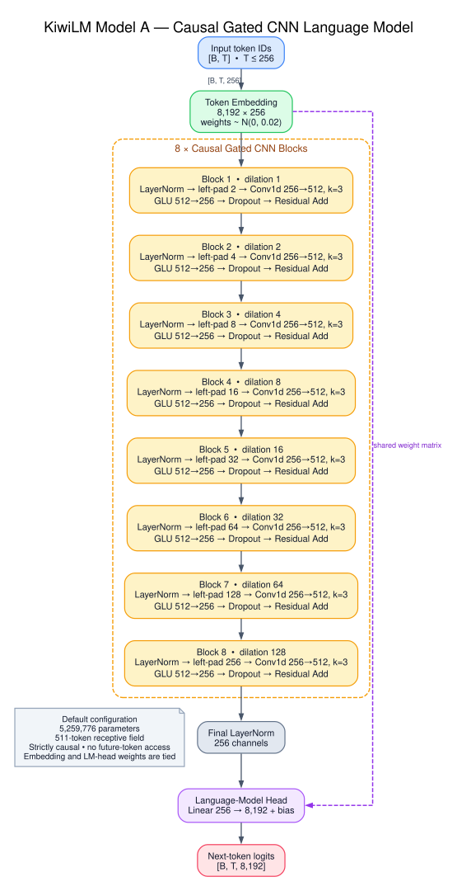
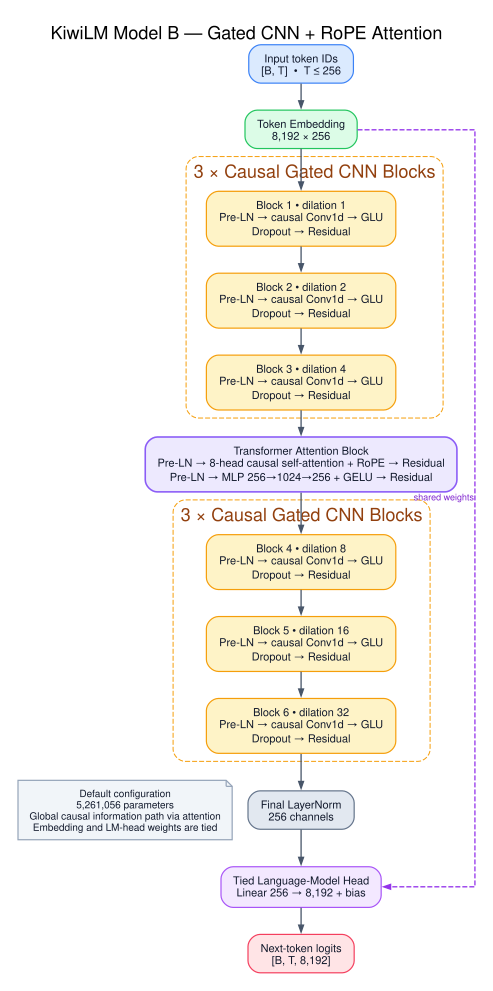
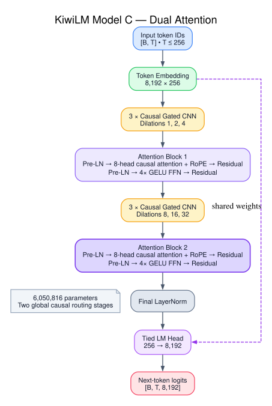
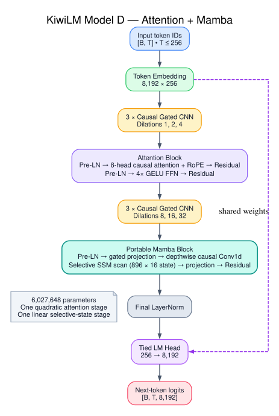

# KiwiLM

KiwiLM is a small research scaffold for comparing causal language-model
architectures on [TinyStories](https://huggingface.co/datasets/roneneldan/TinyStories).
The baseline, Model A, is deliberately simple:

```text
8K byte-level BPE embedding
  -> 8 causal gated convolution blocks
  -> layer normalization
  -> tied language-model head
```

The default network has roughly 5.26 million parameters. Its eight dense gated
convolutions use dilations `1, 2, 4, 8, 16, 32, 64, 128`, giving a 511-token
receptive field over the default 256-token context. Strict left padding makes
every output causal.

Model B keeps the same width and training pipeline while replacing two CNN
blocks with one full Transformer-style attention block:

```text
8K byte-level BPE embedding
  -> 3 causal gated convolution blocks (dilations 1, 2, 4)
  -> pre-normalized 8-head causal self-attention with RoPE
  -> pre-normalized 4x GELU feed-forward network
  -> 3 causal gated convolution blocks (dilations 8, 16, 32)
  -> layer normalization
  -> tied language-model head
```

| Model | Architecture | Parameters |
| --- | --- | ---: |
| A | 8 gated CNN blocks | 5,259,776 |
| B | 3 gated CNNs + attention/FFN + 3 gated CNNs | 5,261,056 |
| C | Model B + final attention/FFN | 6,050,816 |
| D | Model B + final portable Mamba block | 6,027,648 |

Architecture selection is isolated behind a registry, so later Mamba variants
can reuse the tokenizer, prepared token streams, trainer, checkpoints, metrics,
generator, and comparison tooling.









## Setup

KiwiLM uses [uv](https://docs.astral.sh/uv/) for dependency management:

```bash
uv sync
uv run kiwilm --help
```

PyTorch selects CUDA first, then Apple MPS, and finally CPU when `--device auto`
is used.

## Prepare TinyStories

The default is a fast smoke profile: 25,000 training stories and 2,000
validation stories. Data is streamed instead of downloading the entire dataset
up front.

```bash
uv run kiwilm prepare \
  --output-dir data/tinystories
```

Preparation trains an 8K byte-level BPE tokenizer from the selected training
stories only. It writes:

```text
data/tinystories/
  metadata.json
  tokenizer-<content-sha256>.json
  train-<content-sha256>.bin
  validation-<content-sha256>.bin
```

Stories are packed as `[BOS] story [EOS]` in contiguous `uint16` streams. The
metadata records the dataset revision, preprocessing settings, token counts,
and a fingerprint used to reject incompatible checkpoints.

Use different caps for a quicker check:

```bash
uv run kiwilm prepare \
  --output-dir data/tinystories-mini \
  --train-limit 200 \
  --validation-limit 50 \
  --vocab-size 512
```

Passing `0` removes a story cap and processes the complete split:

```bash
uv run kiwilm prepare \
  --output-dir data/tinystories-full \
  --train-limit 0 \
  --validation-limit 0
```

Existing prepared files are not silently overwritten; pass `--force` when the
target directory is intentionally being regenerated.

## Train Model A

```bash
uv run kiwilm train \
  --architecture gated_cnn \
  --data-dir data/tinystories \
  --output-dir runs/model-a
```

## Train Model B

Model B uses the already-prepared TinyStories artifacts and trains from scratch
for a direct comparison:

```bash
uv run kiwilm train \
  --architecture cnn_attention \
  --data-dir data/tinystories \
  --output-dir runs/model-b \
  --device auto
```

The default attention block uses eight heads, RoPE, and a 1,024-channel
feed-forward layer. These can be changed with `--attention-heads` and
`--attention-feedforward-dim`.

## Train Models C and D

Model C adds a second attention block after the final CNN stack:

```bash
uv run kiwilm train \
  --architecture cnn_dual_attention \
  --data-dir data/tinystories \
  --output-dir runs/model-c \
  --device auto
```

Model D replaces that second attention block with a portable Mamba-1-style
selective state-space block. Its default width is chosen to stay within 0.4% of
Model C's parameter count:

```bash
uv run kiwilm train \
  --architecture cnn_attention_mamba \
  --data-dir data/tinystories \
  --output-dir runs/model-d \
  --batch-size 8 \
  --grad-accum-steps 4 \
  --device auto
```

The smaller microbatch bounds activation memory while preserving an effective
batch size of 32. The Mamba implementation uses ordinary PyTorch operations so
it runs on CPU and Apple MPS without CUDA extensions. Its selective scan is
linear in sequence length, but it is a readable reference implementation rather
than a fused performance kernel. Model D still contains one attention block, so
the complete hybrid remains quadratic with a smaller coefficient than Model C.

The fast profile trains for 2,000 optimizer steps with a batch size of 32,
evaluates every 200 steps, and checkpoints every 500 steps. Common overrides
are available from the CLI:

```bash
uv run kiwilm train \
  --data-dir data/tinystories \
  --output-dir runs/model-a \
  --max-steps 100 \
  --batch-size 8 \
  --eval-interval 25 \
  --device auto
```

Training uses AdamW, gradient clipping, linear warmup, cosine decay, and
next-token cross-entropy. Normal output includes the parameter count, concise
step/validation metrics, and a final greedy sample; structured records are also
appended to `metrics.jsonl`. Checkpoints contain the model, optimizer state,
training configuration, step, random states, prepared-data fingerprint, and
batch-sampler state.

Resume the latest checkpoint with:

```bash
uv run kiwilm train \
  --data-dir data/tinystories \
  --output-dir runs/model-a \
  --resume runs/model-a/latest.pt
```

Resume fails clearly if the model, prepared data, optimizer/sampling settings,
or cosine schedule horizon differs from the checkpoint. Reporting intervals
and final-sample settings may change. This keeps an interrupted run equivalent
to uninterrupted training and truncates any metrics newer than the resumed
checkpoint.

## Evaluate and generate

Evaluate validation loss and perplexity:

```bash
uv run kiwilm evaluate \
  --data-dir data/tinystories \
  --checkpoint runs/model-a/best.pt
```

Generate greedily:

```bash
uv run kiwilm generate \
  --data-dir data/tinystories \
  --checkpoint runs/model-a/best.pt \
  --prompt "Once upon a time" \
  --temperature 0
```

Or sample reproducibly:

```bash
uv run kiwilm generate \
  --data-dir data/tinystories \
  --checkpoint runs/model-a/best.pt \
  --prompt "Once upon a time" \
  --max-new-tokens 160 \
  --temperature 0.8 \
  --top-k 40 \
  --seed 42
```

Add `--stream` to print decoded text as each token becomes available:

```bash
uv run kiwilm generate \
  --data-dir data/tinystories \
  --checkpoint runs/model-b/best.pt \
  --prompt "Once upon a time" \
  --max-new-tokens 160 \
  --temperature 0.8 \
  --top-k 40 \
  --seed 42 \
  --stream
```

Streaming uses incremental byte-level decoding, so Unicode characters split
across multiple tokens are emitted only after their complete byte sequence is
available.

Generation is intentionally simple and recomputes the active context at every
step. Architecture-specific inference caches can be introduced with later
variants without changing the sampling contract.

## Compare models

After training Model B, run the checked-in story-consistency prompt suite:

```bash
uv run kiwilm compare \
  --data-dir data/tinystories \
  --checkpoint-a runs/model-a/best.pt \
  --checkpoint-b runs/model-b/best.pt \
  --output-dir runs/comparisons/model-a-vs-model-b \
  --device auto
```

This produces `results.jsonl` for analysis and `report.md` for side-by-side
reading. Both checkpoints receive the same prompt, sampling profile, and seed.
The suite covers named entities, object ownership, two-character stories,
persistent goals, and dialogue locations.

Compare Models B, C, and D in one report:

```bash
uv run kiwilm compare \
  --data-dir data/tinystories \
  --checkpoints \
    runs/model-b/best.pt \
    runs/model-c/best.pt \
    runs/model-d/best.pt \
  --labels "Model B" "Model C" "Model D" \
  --output-dir runs/comparisons/model-b-vs-c-vs-d \
  --device auto
```

The original `--checkpoint-a` and `--checkpoint-b` form remains supported.

## Development

```bash
uv lock --check
uv run ruff check .
uv run pytest -q
```

Tests use miniature local stories and never require network access. They cover
causal isolation, parameter and weight-tying contracts, tokenizer and packed
data behavior, deterministic batches, checkpoints, resume validation,
evaluation, and generation.

## Project layout

```text
src/kiwilm/
  models/        # architecture implementations and registry
  checkpoint.py  # atomic checkpoint I/O and compatibility checks
  cli.py         # prepare/train/evaluate/generate/compare commands
  comparison.py  # reproducible A/B generation reports
  config.py      # serializable model configuration
  data.py        # TinyStories preparation and token batches
  generation.py  # shared decoding
  tokenizer.py   # byte-level BPE wrapper
  training.py    # optimizer, schedule, evaluation, and training loop
```

KiwiLM is a research scaffold, not a pretrained release. The smoke defaults
verify that the pipeline works; they do not imply useful story quality or
full-corpus validation.
