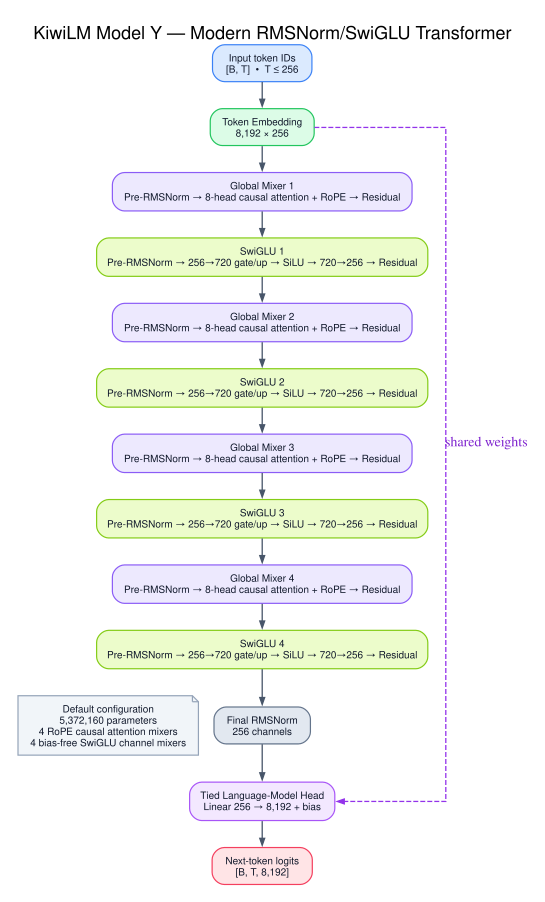
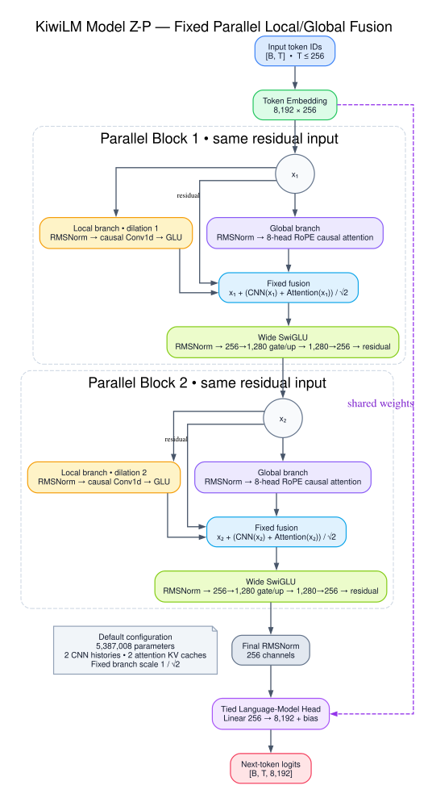
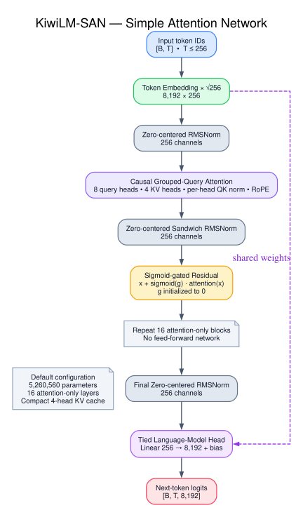

# KiwiLM

KiwiLM is a small PyTorch research project for comparing causal language-model
architectures on
[TinyStories](https://huggingface.co/datasets/roneneldan/TinyStories), with
controlled continued pretraining on
[SimpleStories](https://huggingface.co/datasets/SimpleStories/SimpleStories).
The current work keeps two parameter-matched finalists, an experimental
parallel-fusion wildcard, and an attention-only retrieval candidate:

| Model | Architecture | Parameters |
| --- | --- | ---: |
| X | 2 gated CNN mixers, 2 attention mixers, 4 SwiGLU FFNs | 5,387,520 |
| Y | 4 attention mixers, 4 SwiGLU FFNs | 5,372,160 |
| Z-P | 2 parallel CNN/attention mixers, 2 wide SwiGLU FFNs | 5,387,008 |
| KiwiLM-SAN | 16 QK-normalized GQA mixers, no FFNs | 5,260,560 |

The models share 256-wide embeddings, RoPE causal attention, tied token/LM-head
weights, the tokenizer and prepared-data format, token-counted training,
evaluation, checkpoints, streaming generation, and exact sliding-window KV
caches. KiwiLM-SAN deliberately removes every learned token-wise FFN and
reallocates the parameter budget into attention depth.

Models A–G, the portable Mamba experiment, and the original GPT-style baseline
remain available in the
[legacy models package](src/kiwilm/models/legacy/README.md).

## Final results

The experiment concludes with Model Y as the quality architecture and Model X
as the throughput-oriented alternative. On 500 seeded story-validation
batches, the matched 750k-pretraining checkpoints score:

| Architecture | Parameters | TinyStories loss | TinyStories perplexity | Result |
| --- | ---: | ---: | ---: | --- |
| Model X | 5,387,520 | 1.8695 | 6.4849 | Faster hybrid finalist |
| Model Y | 5,372,160 | **1.8468** | **6.3392** | Quality winner |

The two final released Model Y checkpoints expose a deliberate specialization
tradeoff:

| Checkpoint | SFT v2 PPL | TinyStories PPL | SimpleStories PPL | Recommended use |
| --- | ---: | ---: | ---: | --- |
| Direct SFT v2 | **5.7595** | **6.6368** | 37.5875 | In-domain loss and greedy decoding |
| SimpleStories CPT -> SFT v2 | 6.3614 | 7.5989 | **16.9978** | Focused sampling and broader stories |

| Checkpoint | Profile | Adherence | Required words | Summary | Repeat-4 |
| --- | --- | ---: | ---: | ---: | ---: |
| Direct SFT v2 | greedy | **59.6%** | **55.6%** | **45.8%** | 15.0% |
| CPT -> SFT v2 | greedy | 52.7% | 50.0% | 41.7% | **12.0%** |
| Direct SFT v2 | focused | 65.2% | 55.6% | 50.0% | 5.0% |
| CPT -> SFT v2 | focused | **69.0%** | **66.7%** | **54.2%** | **3.5%** |

The final Model Y Safetensors bundles are published at
[Tasty-Kiwi/KiwiLM](https://huggingface.co/Tasty-Kiwi/KiwiLM), and the
throughput-oriented Model X release is at
[Tasty-Kiwi/KiwiLM-X](https://huggingface.co/Tasty-Kiwi/KiwiLM-X). Full scored
outputs remain in [`examples/comparisons`](examples/comparisons).

## Active architectures

### Model X

Model X alternates inexpensive local mixing with content-dependent global
mixing:

```text
Embedding
  -> gated CNN (dilation 1) -> SwiGLU
  -> RoPE causal attention  -> SwiGLU
  -> gated CNN (dilation 2) -> SwiGLU
  -> RoPE causal attention  -> SwiGLU
  -> final RMSNorm -> tied LM head
```

It has two quadratic attention layers. In the matched smoke benchmark it
trained and generated substantially faster than Model Y while giving up some
validation quality.


### Model Y

Model Y is the modern Transformer control:

```text
Embedding
  -> 4 x [
       pre-RMSNorm RoPE causal attention
       pre-RMSNorm SwiGLU
     ]
  -> final RMSNorm -> tied LM head
```

Its 720-wide SwiGLUs keep it within 0.3% of Model X's parameter count. Model Y
replaces Model X's two gated convolutions with two additional attention
mixers, isolating the quality/throughput effect of the sequence mixer.

The architecture identifier is `model_y`. Checkpoints produced under the
temporary `modern_transformer` name still load and are normalized to Model Y
during reconstruction.



### Model Z-P

Model Z-P tests whether local and global mixing are more useful when they
operate on the same representation rather than sequentially:

```text
Embedding
  -> 2 x [
       ├─ pre-RMSNorm gated causal CNN
       └─ pre-RMSNorm RoPE causal attention
       -> residual + (CNN update + attention update) / sqrt(2)
       -> pre-RMSNorm wide SwiGLU 1280 -> residual
     ]
  -> final RMSNorm -> tied LM head
```

The branches return updates without their own residual additions. This avoids
accidentally adding the block input three times. Separate branch norms allow
local and global processing to specialize while both receive the same residual
representation. The fixed `1 / sqrt(2)` merge isolates parallel topology
without introducing learned routing.

The architecture identifier is `model_z_parallel`. Its cache contains two CNN
histories and two attention KV caches, with the same exact 256-token
crop-and-prefill rollover behavior as Model X.



### KiwiLM-SAN

KiwiLM-SAN is the attention-only retrieval candidate derived from
[A Controlled Study of Attention-Only Transformers](https://arxiv.org/abs/2607.18363):

```text
Embedding x sqrt(256)
  -> 16 x [
       zero-centered RMSNorm
       -> 8-query / 4-KV-head causal GQA with QK norm and RoPE
       -> post-attention zero-centered RMSNorm
       -> sigmoid-gated residual
     ]
  -> final zero-centered RMSNorm -> tied LM head
```

Its 16 layers reclaim the parameters removed with the FFNs while remaining
close to Models X and Y at 5,260,560 parameters. QK normalization and the
post-attention sandwich norm follow the paper's stability and quality
ablations. This first experiment tests plain TinyStories pretraining and
context retrieval only; Hadamard mixers, engram memory, hyper-connections,
continued pretraining, and instruction tuning are intentionally excluded.

The architecture identifier is `kiwilm_san`. Its cache stores four KV heads per
layer and expands them only for eight-head query attention, retaining the same
256-token crop-and-prefill rollover behavior as the other active models.



## Setup

KiwiLM uses [uv](https://docs.astral.sh/uv/) for dependency management:

```bash
uv sync
uv run kiwilm --help
```

With `--device auto`, training selects CUDA first, Apple MPS second, and CPU
otherwise. Select CUDA explicitly with `--device cuda`. FP16 training is
enabled with `--precision fp16`.

## Dataset profiles

The smoke and 750k datasets are separate prepared datasets with different
tokenizers and fingerprints. By default, a checkpoint can only be evaluated
or generated with its own prepared dataset. Cross-dataset evaluation is
available through an explicit evaluation-only opt-in described below.

The verified prepared artifacts resolve to this TinyStories revision:

```text
f54c09fd23315a6f9c86f9dc80f725de7d8f9c64
```

Prepared directories are content-addressed and are not overwritten
automatically. Use `--force` only when intentionally rebuilding a directory.
The smoke and historical 550k fingerprints record `main` as the requested
revision, so their commands state `--revision main` explicitly and the resolved
revision must be checked before training. The derived 750k corpus pins the
immutable revision directly.

### Smoke dataset: 25k training stories

Prepare exactly 25,000 training stories and 2,000 validation stories:

```bash
uv run kiwilm prepare \
  --output-dir data/tinystories \
  --revision main \
  --train-limit 25000 \
  --validation-limit 2000 \
  --vocab-size 8192 \
  --min-frequency 2
```

Expected metadata:

| Field | Value |
| --- | --- |
| Training stories | 25,000 |
| Validation stories | 2,000 |
| Vocabulary | 8,192 |
| Fingerprint | `a01d7037441e4cc0f1fe48615d384761c47cea506101708bbe42a0cee8ec7418` |

The controlled smoke benchmark retrains X, Y, and Z-P from scratch for 2,000
packed steps and 16,384,000 targets each:

```bash
uv run python scripts/run_model_xyz_smoke_benchmark.py \
  --device auto
```

Results are written under:

```text
runs/benchmarks/model-xyz-smoke/
  model-x/
  model-y/
  model-z-parallel/
  comparison/report.md
  comparison/results.jsonl
  summary.json
```

The runner refuses to overwrite a non-empty output directory. In addition to
matched loss, throughput, and cached/uncached generation measurements, it
records each Z-P block's CNN and attention output RMS, norm ratio, cosine
similarity, and merged-update-to-residual RMS.

The KiwiLM-SAN smoke runner trains only SAN and evaluates it beside the saved
Model X and Model Y smoke checkpoints:

```bash
uv run python scripts/run_kiwilm_san_smoke_benchmark.py \
  --device mps
```

It uses the same 2,000 packed FP32 steps, 256-token context, seed, optimizer,
and 16,384,000-target budget. Post-training evaluation reruns all three models
on the current device, but only SAN's live training throughput is reported as
comparable. The runner also writes a deterministic counterfactual retrieval
report at needle distances of 32, 64, 128, and 192 tokens:

```text
runs/benchmarks/kiwilm-san-smoke/
  kiwilm-san/
  comparison/report.md
  comparison/results.jsonl
  retrieval/report.md
  retrieval/results.jsonl
  retrieval/suite.json
  summary.json
```

By default it reads the X/Y baselines from
`runs/benchmarks/model-xyz-smoke/model-x/best.pt` and
`runs/benchmarks/model-xyz-smoke/model-y/best.pt`. Both paths are configurable,
and the runner rejects checkpoints with a mismatched architecture, tokenizer,
context length, or prepared-data fingerprint.

The retrieval suite is also reusable independently of training:

```bash
uv run python scripts/evaluate_context_retrieval.py \
  --data-dir data/tinystories \
  --checkpoint runs/benchmarks/kiwilm-san-smoke/kiwilm-san/best.pt \
  --label KiwiLM-SAN \
  --device mps
```

For a 4 GB Windows CUDA GPU, retain the same effective batch and exact target
count with FP16 microbatches:

```powershell
uv run --no-sync python scripts/run_model_xyz_smoke_benchmark.py `
  --device cuda `
  --precision fp16 `
  --batch-size 8 `
  --grad-accum-steps 4
```

### Full comparison dataset: 750k training stories

The 750k dataset deliberately reuses the tokenizer trained for the historical
550k corpus. This freezes token bytes and IDs across the full Model E/F/B/X/Y
comparison.

If `data/tinystories-550k` is not already present, prepare the tokenizer source:

```bash
uv run kiwilm prepare \
  --output-dir data/tinystories-550k \
  --revision main \
  --train-limit 550000 \
  --validation-limit 10000 \
  --vocab-size 8192 \
  --min-frequency 2
```

Before continuing, check `data/tinystories-550k/metadata.json`:

| Field | Expected value |
| --- | --- |
| Resolved revision | `f54c09fd23315a6f9c86f9dc80f725de7d8f9c64` |
| Dataset fingerprint | `d2f500e2a85cf7c1a1c1b292b2f186c04782e9443312aaea5f1dc08a561dc764` |
| Tokenizer SHA-256 | `0127391ca334542dd206b0bef735b571d3739e5a399e89bbe0b42e79a09d9226` |

Now prepare the pinned 750k corpus by reusing that tokenizer:

```bash
uv run kiwilm prepare \
  --output-dir data/tinystories-750k \
  --revision f54c09fd23315a6f9c86f9dc80f725de7d8f9c64 \
  --train-limit 750000 \
  --validation-limit 10000 \
  --tokenizer-from data/tinystories-550k
```

Expected 750k metadata:

| Field | Value |
| --- | --- |
| Training stories | 750,000 |
| Validation stories | 10,000 |
| Training tokens | 167,114,470 |
| Validation tokens | 2,021,315 |
| Tokenizer SHA-256 | `0127391ca334542dd206b0bef735b571d3739e5a399e89bbe0b42e79a09d9226` |
| Fingerprint | `6b2687870c402c5e70e677e8a6c88bb854786c8dcb963f9c734feb022862ed82` |

Preparation copies the tokenizer byte-for-byte and records content hashes
rather than machine-specific source paths.

## Train Models X and Y on 750k

Use the same 160,465,920-target budget, warmup, story-safe batching, seed, and
validation schedule for both models. This is a matched-data, matched-token
comparison; it gives each model about 29.8 targets per parameter.

Model X:

```bash
uv run kiwilm train \
  --architecture model_x \
  --data-dir data/tinystories-750k \
  --output-dir runs/model-x-750k \
  --device cuda \
  --batch-mode story \
  --precision fp16 \
  --max-tokens 160465920 \
  --warmup-tokens 8023296 \
  --max-steps 17000 \
  --batch-size 64 \
  --eval-mode both \
  --eval-interval 500 \
  --eval-batches 50 \
  --checkpoint-interval 500 \
  --log-interval 10 \
  --seed 42
```

Model Y:

```bash
uv run kiwilm train \
  --architecture model_y \
  --data-dir data/tinystories-750k \
  --output-dir runs/model-y-750k \
  --device cuda \
  --batch-mode story \
  --precision fp16 \
  --max-tokens 160465920 \
  --warmup-tokens 8023296 \
  --max-steps 17000 \
  --batch-size 64 \
  --eval-mode both \
  --eval-interval 500 \
  --eval-batches 50 \
  --checkpoint-interval 500 \
  --log-interval 10 \
  --seed 42
```

Story batching never crosses story boundaries. Padding targets use `-100` and
do not count toward the token budget, loss denominator, or valid-token
throughput. With `--eval-mode both`, story-safe validation selects the best
checkpoint and packed validation is reported as a secondary metric.

## SimpleStories continued pretraining

Continued pretraining (CPT) is the controlled bridge between TinyStories
pretraining and instruction fine-tuning. The initial experiment uses 250,000
SimpleStories training examples, 10,000 held-out test examples, and exactly
50,000,000 next-token targets. It reuses the 750k TinyStories tokenizer
byte-for-byte, so the embedding and tied LM-head rows retain their meaning.

Preparation pins the SimpleStories dataset to
`e63b8adc3b1a1bdc7cac5b500d150b71346b0628`. Its upstream `test` split is
stored as KiwiLM's `validation` split:

```bash
uv run kiwilm prepare-simplestories \
  --output-dir data/simplestories-250k \
  --tokenizer-from data/tinystories-750k \
  --train-limit 250000 \
  --validation-limit 10000
```

Continue Model Y from its best 750k checkpoint:

```bash
uv run kiwilm cpt \
  --data-dir data/simplestories-250k \
  --init-from runs/model-y-750k/best.pt \
  --output-dir runs/model-y-simplestories-cpt \
  --device cuda \
  --precision fp16 \
  --max-tokens 50000000 \
  --warmup-tokens 1000000 \
  --max-steps 6000 \
  --batch-size 64 \
  --eval-interval 500 \
  --eval-batches 50 \
  --checkpoint-interval 500 \
  --log-interval 10 \
  --seed 42
```

For the matched Model X run, change the source checkpoint and output directory
to `runs/model-x-750k/best.pt` and
`runs/model-x-simplestories-cpt`. `--init-from` loads only model weights;
optimizer, schedule, sampler, token count, and AMP scaler start fresh.
Before training, CPT verifies that the frozen-tokenizer provenance names the
source checkpoint's exact prepared-data fingerprint; matching vocabulary size
alone is not accepted.
Use `--resume runs/model-y-simplestories-cpt/latest.pt` to resume an interrupted
CPT run exactly. `--init-from` and `--resume` are mutually exclusive.

Evaluate the CPT checkpoint on SimpleStories normally:

```bash
uv run kiwilm evaluate \
  --data-dir data/simplestories-250k \
  --checkpoint runs/model-y-simplestories-cpt/best.pt \
  --device cuda \
  --precision fp16 \
  --batch-mode story \
  --batch-size 64 \
  --batches 500
```

To measure retention on the original TinyStories validation data, explicitly
allow the expected dataset-fingerprint mismatch:

```bash
uv run kiwilm evaluate \
  --data-dir data/tinystories-750k \
  --checkpoint runs/model-y-simplestories-cpt/best.pt \
  --device cuda \
  --precision fp16 \
  --batch-mode story \
  --batch-size 64 \
  --batches 500 \
  --allow-data-mismatch
```

The output records both fingerprints and `data_mismatch: true`. The CLI still
checks that the prepared tokenizer vocabulary size matches the checkpoint.
This flag only relaxes evaluation; generation and comparison retain strict
dataset matching. For a clean before/after retention comparison, evaluate the
original 750k checkpoint with the same batch mode, count, and seed.

Once CPT is selected, initialize SFT v2 from the CPT `best.pt` instead of the
original 750k checkpoint. Do not resume a TinyStories training checkpoint
against SimpleStories: `cpt --init-from` is the intentional weight-only
dataset transition.

## Supervised instruction fine-tuning

The SFT path uses the official `roneneldan/TinyStoriesInstruct` text files and
the tokenizer already frozen for the 750k pretraining comparison. Preparation
parses `<|endoftext|>`-separated records into a canonical conditional prompt:

```text
Features: ...
Words: ...
Summary: ...
Random sentence: ...
Story:
```

Only fields present in a source record are included. Prompt tokens are masked
from the loss; the story response and its final EOS token are supervised.
Long responses are split into non-overlapping target chunks, so each response
target is counted exactly once per epoch and examples never mix. Chunks are
shuffled deterministically; sampler epoch and cursor are checkpointed for exact
resume.

Prepare the recommended constraint-aware v2 50k/5k instruction split:

```bash
uv run kiwilm prepare-instruct \
  --output-dir data/tinystories-instruct-v2-50k \
  --tokenizer-from data/tinystories-750k \
  --train-limit 50000 \
  --validation-limit 5000 \
  --sft-format v2 \
  --required-word-weight 3
```

SFT v2 prepends a fixed instruction telling the model to follow every
condition and use each requested word. It also writes a content-addressed
one-byte-per-token constraint mask. During training, response tokens that
spell exact requested-word occurrences receive 3x loss weight; all other
response tokens retain weight 1, while prompt and padding tokens remain at
zero. Valid-target token budgets still count every response target once, and
validation remains ordinary unweighted response perplexity. This keeps
checkpoint selection and X/Y comparisons directly interpretable.

The original artifact format remains available by omitting `--sft-format v2`.
Existing v1 datasets and checkpoints continue to load unchanged. Generation,
training samples, and adherence reports automatically add the v2 instruction
prefix when the selected prepared dataset requires it, so prompts supplied at
the CLI still begin with `Features:`.

The download is pinned to a known TinyStoriesInstruct revision. For an offline
or manually downloaded copy, add both `--train-file` and `--validation-file`.
Preparation copies the tokenizer bytes and token IDs exactly and records
content hashes rather than a machine-specific tokenizer source path. The
official training text contains a few truncated UTF-8 punctuation sequences;
preparation deterministically replaces only malformed sequences while
preserving the ASCII record delimiters and surrounding story text. It also
skips and reports structurally incomplete fragments, including the partial
record at the beginning of the pinned validation file; limits count valid
instruction examples.

Fine-tune Model X from its best 750k checkpoint:

```bash
uv run kiwilm sft \
  --data-dir data/tinystories-instruct-v2-50k \
  --init-from runs/model-x-750k/best.pt \
  --output-dir runs/model-x-instruct-v2 \
  --device cuda \
  --precision fp16 \
  --batch-size 8 \
  --grad-accum-steps 4 \
  --max-tokens 10000000 \
  --warmup-tokens 250000 \
  --max-steps 10000 \
  --seed 42
```

Use `runs/model-y-750k/best.pt` and `runs/model-y-instruct` for the matched
Model Y run. `--init-from` loads model weights only: optimizer, learning-rate
schedule, sampler, token count, and AMP scaler start fresh. To continue an
interrupted SFT run exactly, use `--resume runs/model-x-instruct/latest.pt`
instead; `--init-from` and `--resume` are intentionally mutually exclusive.

Evaluate response-only validation:

```bash
uv run kiwilm evaluate \
  --data-dir data/tinystories-instruct-v2-50k \
  --checkpoint runs/model-x-instruct-v2/best.pt \
  --batch-mode sft \
  --batches 50 \
  --precision fp16 \
  --device cuda
```

SFT validation uses a fresh deterministic epoch-shuffled chunk order derived
from `--seed` on every call. Training evaluations and standalone evaluations
therefore cover the same targets for a fixed seed, batch size, and batch count;
checkpoint selection no longer benefits from a lucky changing sample.

Generate from the same conditional format:

```bash
uv run kiwilm generate \
  --data-dir data/tinystories-instruct-v2-50k \
  --checkpoint runs/model-x-instruct-v2/best.pt \
  --prompt $'Features: Dialogue\nWords: oak, gloomy, kind\nSummary: Two friends help each other get home before dark.\nStory:\n' \
  --max-new-tokens 200 \
  --temperature 0.7 \
  --top-k 40 \
  --cache auto \
  --stream
```

Generate a scored adherence comparison:

```bash
uv run kiwilm sft-report \
  --data-dir data/tinystories-instruct-50k \
  --checkpoints \
    runs/model-x-instruct-3epoch/best.pt \
    runs/model-x-instruct-3epoch/latest.pt \
    runs/model-y-instruct/best.pt \
  --labels "Model X best" "Model X latest" "Model Y" \
  --suite eval/instruction-adherence-prompts.json \
  --output-dir examples/comparisons/sft-adherence \
  --device cuda
```

The report uses six fixed prompts with greedy and focused decoding. It writes
`results.jsonl`, `summary.json`, and `report.md`, measuring exact required-word
coverage, summary-term coverage, dialogue compliance, named-entity retention,
and repeated sentence/four-token fractions. These are deterministic lexical
checks rather than semantic-judge scores, so the generated stories remain
available in the report for qualitative review.

## Evaluate and generate

Evaluate story-safe validation:

```bash
uv run kiwilm evaluate \
  --data-dir data/tinystories-750k \
  --checkpoint runs/model-y-750k/best.pt \
  --batch-mode story \
  --batches 50 \
  --precision fp16 \
  --device auto
```

Repeat with `--batch-mode packed` for the secondary packed metric.

Generate with streaming and automatic KV caching:

```bash
uv run kiwilm generate \
  --data-dir data/tinystories-750k \
  --checkpoint runs/model-y-750k/best.pt \
  --prompt "Once upon a time" \
  --max-new-tokens 160 \
  --temperature 0.8 \
  --top-k 40 \
  --seed 42 \
  --cache auto \
  --stream
```

Use `--cache off` for historical comparison reports or on hardware where the
short-context cache overhead exceeds the saved computation.

## Repository layout

```text
src/kiwilm/
  models/
    attention.py       shared RoPE/SDPA attention
    model_x.py         active hybrid
    model_y.py         active modern Transformer
    model_z_parallel.py experimental fixed parallel fusion
    kiwilm_san.py      attention-only GQA retrieval candidate
    legacy/            Models A-G, Mamba, and GPT baseline
  data.py              TinyStories preparation and batching
  sft.py               instruction parsing and response-only SFT batches
  sft_report.py        scored instruction-adherence generation reports
  training.py          packed/story-safe token-counted training
  generation.py        cached and streaming autoregressive generation
scripts/
  run_model_xyz_smoke_benchmark.py
  run_kiwilm_san_smoke_benchmark.py
eval/
  story-consistency-prompts.json
```

Checkpoints contain the model and optimizer state, model/training
configuration, data fingerprint, sampler state, random states, token count,
and AMP scaler where applicable. Resume rejects incompatible architecture,
data, optimizer, sampler, or schedule settings.

## Verification

```bash
uv run ruff check .
uv run pytest -q
uv lock --check
```
