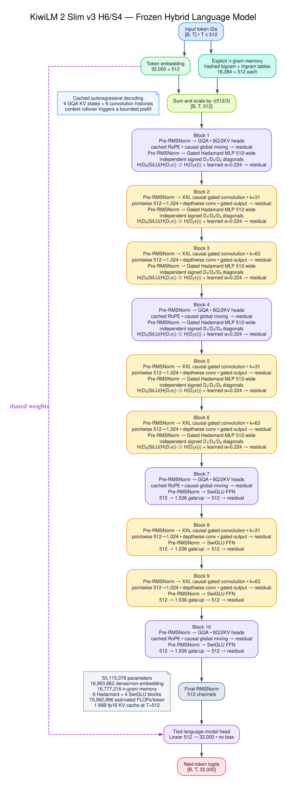

# KiwiLM 2

Experimental hardware qualification: [single-chip Colab TPU smoke](docs/tpu-smoke.md).

KiwiLM 2 is a controlled language-model architecture experiment combining
periodic grouped-query attention, large-kernel causal gated convolutions, and
hashed bigram/trigram embeddings. The repository contains three active variants:

- `kiwilm2`: a 64.25M-parameter backbone with 1536-wide SwiGLU feed-forward blocks.
- `kiwilm2_slim`: a 40.69M-parameter control using gated, width-preserving
  Hadamard MLPs with independent signed diagonals and depth-scaled learned
  residual gains.
- `kiwilm2_slim_v3`: a hybrid ablation with gated Hadamard lower blocks and a
  contiguous upper SwiGLU suffix. H6/S4 is active; H7/S3 remains loadable only
  for historical checkpoint compatibility.

Both use a 32K tokenizer, 512-token context, tied token embeddings and LM head,
8 query heads, 2 KV heads, cached RoPE on attention blocks, and the fixed mixer
schedule `GQA → Conv31 → Conv63` repeated three times followed by a final GQA.

Earlier KiwiLM architectures and their reports are preserved on the `legacy`
branch. Check out that branch to load historical checkpoints.




The complete architecture, data, Colab, checkpoint, and evaluation specification
is in the [KiwiLM 2 runbook](docs/kiwilm2.md).

## Setup

KiwiLM uses Python 3.11 or newer and [uv](https://docs.astral.sh/uv/).

macOS or Linux:

```bash
curl -LsSf https://astral.sh/uv/install.sh | sh
uv sync --locked
uv run kiwilm --help
```

Windows PowerShell:

```powershell
powershell -ExecutionPolicy ByPass -c "irm https://astral.sh/uv/install.ps1 | iex"
uv sync --locked
uv run --locked python -c "import torch; print(torch.__version__); print(torch.version.cuda); print(torch.cuda.is_available()); print(torch.cuda.get_device_name(0) if torch.cuda.is_available() else 'NO CUDA GPU')"
```

The lock selects PyTorch's official CUDA 13.2 wheel index on Windows, so
`uv sync` and `uv run` no longer replace a CUDA installation with PyPI's CPU
wheel. macOS and Linux continue to use their normal PyPI resolution.

## Prepare data

Prepare the reproducible 50M-token FineWeb-Edu and Cosmopedia smoke corpus:

```bash
uv run kiwilm prepare-smollm \
  --profile smoke \
  --output-dir data/smollm-smoke
```

Larger profiles must reuse its tokenizer:

```bash
uv run kiwilm prepare-smollm \
  --profile architecture \
  --tokenizer-from data/smollm-smoke \
  --output-dir data/smollm-architecture
```

TinyStories and SimpleStories preparation remain available for frozen-tokenizer
external evaluation. `prepare-instruct`, `cpt`, and `sft` remain available for
later controlled adaptation experiments.

## Train

Run the matched Dense and Slim smoke comparison:

```bash
uv run python scripts/run_kiwilm2_experiment.py \
  --phase smoke \
  --data-dir data/smollm-smoke \
  --output-dir runs/kiwilm2-smoke \
  --device cuda \
  --precision fp16
```

Train one variant directly:

```bash
uv run kiwilm train \
  --architecture kiwilm2 \
  --data-dir data/smollm-smoke \
  --output-dir runs/kiwilm2 \
  --device cuda \
  --precision fp16 \
  --context-length 512 \
  --d-model 512 \
  --query-heads 8 \
  --kv-heads 2 \
  --swiglu-dim 1536 \
  --bigram-buckets 16384 \
  --trigram-buckets 16384 \
  --batch-size 8 \
  --grad-accum-steps 4 \
  --max-tokens 50000000 \
  --max-steps 3152
```

Use `--architecture kiwilm2_slim` for gated Slim v2. Add `--compile-mode
compiled` to force `torch.compile`; eager remains the portable local default.
Muon is deliberately restricted to Dense; AdamW is the shared baseline.

After the Dense Muon 0.01 analysis, audit the existing 250M Dense-AdamW and
ungated H6/S4 checkpoints before changing the model:

```bash
uv run --locked python scripts/audit_kiwilm2_residual_growth.py \
  --data-dir data/smollm-architecture \
  --smoke-data-dir data/smollm-smoke \
  --dense runs/kiwilm2-architecture/kiwilm2-adamw/latest.pt \
  --h6s4 runs/kiwilm2-slim-v3-architecture2/kiwilm2-slim-v3-h6-s4-adamw/latest.pt \
  --output examples/comparisons/kiwilm2-slim-v3-residual-audit/audit.json \
  --device cuda --precision bf16
```

Only an exact 100-batch audit that reproduces block-9 growth authorizes the
alpha=0.25 and alpha=0.5 smoke launchers. See the runbook for Windows and Colab
commands and the complete promotion rules.

## Colab

The launchers prepare data inside the Colab VM and optionally mirror completed
checkpoints to Google Drive:

```bash
scripts/run_colab_kiwilm2_smoke.sh
scripts/run_colab_kiwilm2_slim_smoke.sh
scripts/run_colab_kiwilm2_slim_v3_smoke.sh
scripts/run_colab_kiwilm2_slim_v3_residual_gates_smoke.sh
scripts/run_colab_kiwilm2_slim_v3_gate050_architecture.sh
scripts/run_colab_kiwilm2_architecture.sh
scripts/run_colab_kiwilm2_muon_sweep.sh
```

The architecture launcher runs the controlled 250M-token Dense and gated-Slim
pair. It uses 200 validation batches, a 5M-token warmup, and an automatically
derived 15,359-step ceiling while stopping exactly at 250M tokens. Windows
PowerShell preparation and training commands are documented in the
[KiwiLM 2 runbook](docs/kiwilm2.md#colab-launchers).

T4 and fp16 are the defaults. The Slim-only launcher benchmarks Dense eager,
Slim eager, and Slim compiled on the same VM, selecting compiled execution only
when it is both the fastest Slim path and faster than Dense. Set
`KIWILM2_COMPILE_POLICY` to `eager`, `compiled`, or `auto`. The generic launcher
also accepts overrides for phase, variant, optimizer, GPU, precision, batch
size, Drive root, resume checkpoint, and output directory.

## Evaluate and inspect

```bash
uv run kiwilm evaluate \
  --data-dir data/smollm-smoke \
  --checkpoint runs/kiwilm2/best.pt

uv run kiwilm generate \
  --data-dir data/smollm-smoke \
  --checkpoint runs/kiwilm2/best.pt \
  --prompt "Once upon a time"

uv run kiwilm profile-kiwilm2 --architecture kiwilm2
```

The repository also retains side-by-side generation, retrieval, CPT, SFT,
instruction scoring, portable tokenizer export, and Safetensors export commands.
Use `uv run kiwilm <command> --help` for their interfaces.

The completed 50M-token minimal-Slim-v1, gated-v2 smoke, and 250M architecture
evidence is stored under `examples/comparisons`. The Slim v3 comparison folder
contains the provenance, evaluation, and promotion commands to run after both
hybrid checkpoints arrive. The original minimal-v1 report remains at
[examples/comparisons/kiwilm2-smoke-dense-vs-slim](examples/comparisons/kiwilm2-smoke-dense-vs-slim/analysis.md).

## Repository layout

```text
src/kiwilm/        model, data, training, evaluation, and export library
scripts/           KiwiLM 2 experiment, Colab, retrieval, and reporting tools
docs/              KiwiLM 2 runbook and generated architecture diagrams
eval/              fixed generation and instruction-evaluation suites
examples/          retained Dense-vs-Slim comparison evidence
tests/             active KiwiLM 2 and generic workflow coverage
```

Prepared datasets, checkpoints, runs, build outputs, and local environment files
are ignored because they are reproducible or stored externally.

## Verification

```bash
uv lock --check
uv run --locked ruff check src scripts tests
uv run --locked pytest -q
uv build
```
