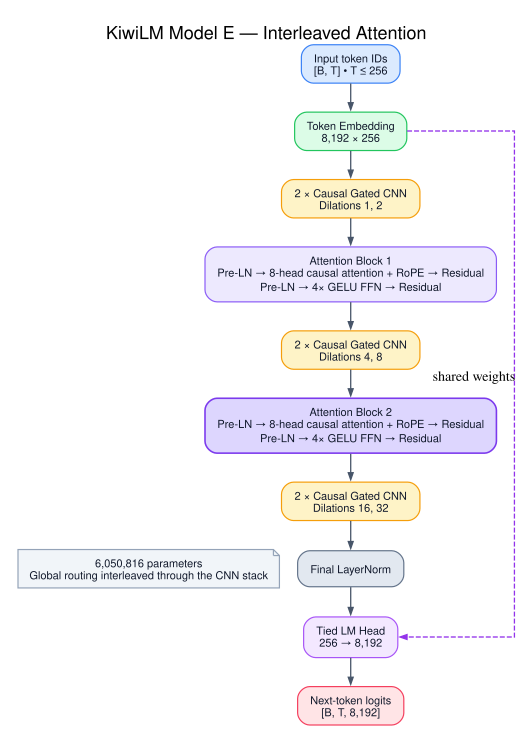
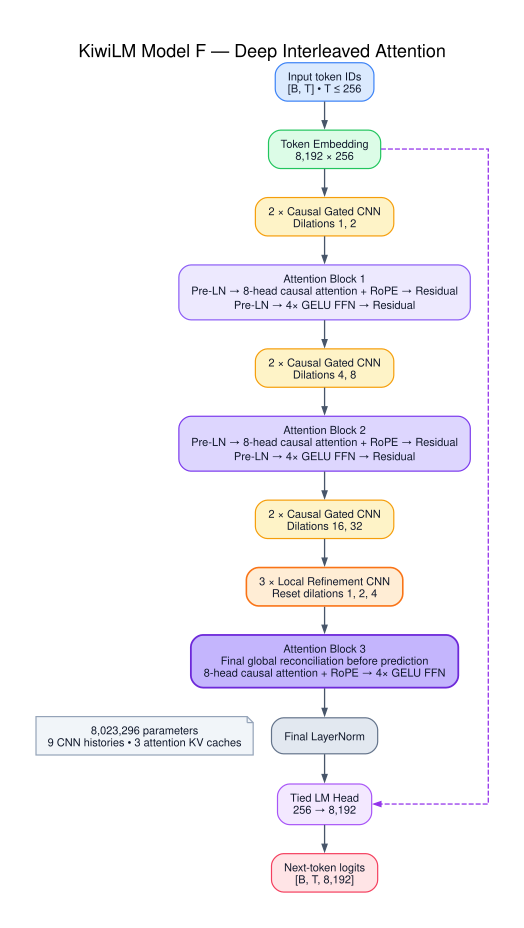
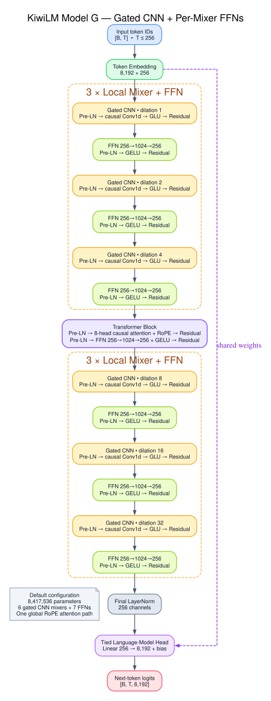
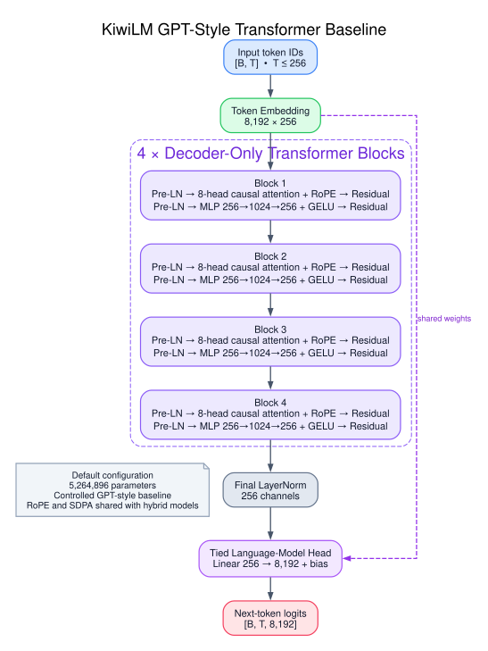

# KiwiLM

KiwiLM is a small research scaffold for comparing causal language-model
architectures on [TinyStories](https://huggingface.co/datasets/roneneldan/TinyStories).
The baseline, Model A, is deliberately simple:

```text
8K byte-level BPE embedding
  -> 8 causal gated convolution blocks
  -> layer normalization
  -> tied language-model head
```

The default network has roughly 5.26 million parameters. Its eight dense gated
convolutions use dilations `1, 2, 4, 8, 16, 32, 64, 128`, giving a 511-token
receptive field over the default 256-token context. Strict left padding makes
every output causal.

Model B keeps the same width and training pipeline while replacing two CNN
blocks with one full Transformer-style attention block:

```text
8K byte-level BPE embedding
  -> 3 causal gated convolution blocks (dilations 1, 2, 4)
  -> pre-normalized 8-head causal self-attention with RoPE
  -> pre-normalized 4x GELU feed-forward network
  -> 3 causal gated convolution blocks (dilations 8, 16, 32)
  -> layer normalization
  -> tied language-model head
```

| Model | Architecture | Parameters |
| --- | --- | ---: |
| A | 8 gated CNN blocks | 5,259,776 |
| B | 3 gated CNNs + attention/FFN + 3 gated CNNs | 5,261,056 |
| C | Model B + final attention/FFN | 6,050,816 |
| D | Model B + final portable Mamba block | 6,027,648 |
| E | 2 CNNs + attention + 2 CNNs + attention + 2 CNNs | 6,050,816 |
| F | Model E + 3 refinement CNNs + final attention/FFN | 8,023,296 |
| G | Model B + residual FFN after every gated CNN | 8,417,536 |
| X | 2 gated CNNs + 2 attention mixers + 4 SwiGLU FFNs | 5,387,520 |
| GPT baseline | 4 decoder-only Transformer blocks | 5,264,896 |

Architecture selection is isolated behind a registry, so later Mamba variants
can reuse the tokenizer, prepared token streams, trainer, checkpoints, metrics,
generator, and comparison tooling.











## Setup

KiwiLM uses [uv](https://docs.astral.sh/uv/) for dependency management:

```bash
uv sync
uv run kiwilm --help
```

PyTorch selects CUDA first, then Apple MPS, and finally CPU when `--device auto`
is used.

## Prepare TinyStories

The default is a fast smoke profile: 25,000 training stories and 2,000
validation stories. Data is streamed instead of downloading the entire dataset
up front.

```bash
uv run kiwilm prepare \
  --output-dir data/tinystories
```

Preparation trains an 8K byte-level BPE tokenizer from the selected training
stories only. It writes:

```text
data/tinystories/
  metadata.json
  tokenizer-<content-sha256>.json
  train-<content-sha256>.bin
  validation-<content-sha256>.bin
```

Stories are packed as `[BOS] story [EOS]` in contiguous `uint16` streams. The
metadata records the dataset revision, preprocessing settings, token counts,
and a fingerprint used to reject incompatible checkpoints.

Use different caps for a quicker check:

```bash
uv run kiwilm prepare \
  --output-dir data/tinystories-mini \
  --train-limit 200 \
  --validation-limit 50 \
  --vocab-size 512
```

Passing `0` removes a story cap and processes the complete split:

```bash
uv run kiwilm prepare \
  --output-dir data/tinystories-full \
  --train-limit 0 \
  --validation-limit 0
```

Existing prepared files are not silently overwritten; pass `--force` when the
target directory is intentionally being regenerated.

To expand a corpus without changing the token vocabulary or token IDs, reuse a
validated tokenizer from an existing prepared dataset:

```bash
uv run kiwilm prepare \
  --output-dir data/tinystories-750k \
  --revision f54c09fd23315a6f9c86f9dc80f725de7d8f9c64 \
  --train-limit 750000 \
  --validation-limit 10000 \
  --tokenizer-from data/tinystories-550k
```

The tokenizer artifact is copied byte-for-byte. Preparation verifies the
source dataset and rejects conflicting vocabulary or minimum-frequency
settings. Metadata records only the source dataset fingerprint and tokenizer
content hash, keeping fingerprints independent of machine-specific paths.
For the pinned 750k preparation above, the resulting dataset fingerprint is
`6b2687870c402c5e70e677e8a6c88bb854786c8dcb963f9c734feb022862ed82`.

## Train Model A

```bash
uv run kiwilm train \
  --architecture gated_cnn \
  --data-dir data/tinystories \
  --output-dir runs/model-a
```

## Train Model B

Model B uses the already-prepared TinyStories artifacts and trains from scratch
for a direct comparison:

```bash
uv run kiwilm train \
  --architecture cnn_attention \
  --data-dir data/tinystories \
  --output-dir runs/model-b \
  --device auto
```

The default attention block uses eight heads, RoPE, and a 1,024-channel
feed-forward layer. These can be changed with `--attention-heads` and
`--attention-feedforward-dim`.

### Train Model B2 on 500k stories

B2 keeps Model B's weights and architecture but uses story-safe batches, CUDA
FP16 AMP, a token-counted learning-rate schedule, and both story-safe and packed
validation. The 105,221,120-target budget is exactly 20 targets per parameter:

```bash
uv run kiwilm train \
  --architecture cnn_attention \
  --data-dir data/tinystories-500k \
  --output-dir runs/model-b2 \
  --device cuda \
  --batch-mode story \
  --precision fp16 \
  --max-tokens 105221120 \
  --warmup-tokens 5261056 \
  --max-steps 12000 \
  --batch-size 64 \
  --eval-mode both \
  --eval-interval 500 \
  --eval-batches 50 \
  --checkpoint-interval 500 \
  --log-interval 10 \
  --seed 42
```

Story mode derives content-addressed boundary indexes alongside the existing
packed files. It never changes the prepared-data fingerprint, so previous
checkpoints remain compatible. Each story target is used once per shuffled
epoch; final chunks are padded and excluded from loss and throughput counts.
When both validation modes are enabled, the fixed story-safe sample selects the
best checkpoint and packed validation is reported as a secondary metric.

To verify the workflow on a Colab T4 without starting the full run, first
authenticate the Colab CLI, then execute:

```bash
scripts/run_colab_b2_smoke.sh
```

The script builds and uploads the current wheel, provisions the named
`kiwilm-b2-smoke` session, runs a one-million-target FP16 smoke train, downloads
the summary and session log to `runs/colab-b2-smoke`, and stops the VM even if a
step fails.

Run the complete 500k-story B2 train with:

```bash
scripts/run_colab_b2_full.sh
```

The full runner uploads the exact local prepared artifacts, trains for
105,221,120 valid targets, and downloads `best.pt`, `latest.pt`,
`metrics.jsonl`, `summary.json`, and the Colab session log to
`runs/model-b2-colab`. It uses a named T4 session and always stops it during
cleanup.

## Train the GPT-style Transformer baseline

The controlled Transformer baseline replaces Model B's gated convolutions with
four decoder-only attention/FFN blocks. It deliberately reuses KiwiLM's RoPE,
SDPA attention, pre-normalization, GELU feed-forward layers, tokenizer, tied
head, and training pipeline. This isolates the sequence mixer instead of trying
to reproduce every GPT-2 implementation detail:

```bash
uv run kiwilm train \
  --architecture transformer \
  --data-dir data/tinystories \
  --output-dir runs/transformer \
  --device auto
```

Run a controlled local smoke benchmark that retrains Model B and the Transformer
for the historical 2,000-step, 16,384,000-target profile:

```bash
uv run python scripts/run_transformer_smoke_benchmark.py \
  --device auto
```

The runner requires the checked 25k-story dataset fingerprint, refuses to
overwrite a non-empty result directory, evaluates both checkpoints on identical
packed and story-safe validation batches, measures cached and uncached greedy
generation, and writes the report and raw evidence under
`runs/benchmarks/transformer-smoke`.

Train the same Transformer on Model F's frozen-tokenizer 750k dataset and exact
160,465,920-target budget with:

```bash
scripts/run_colab_transformer_750k.sh
```

The runner validates the prepared dataset locally, uploads it in 32 MiB chunks,
allocates a named T4, and asks for interactive Google Drive authorization before
training. It periodically publishes atomically replaced, SHA-256-verified
checkpoints, metrics, tokenizer, and dataset metadata under
`My Drive/KiwiLM/transformer-750k/<UTC timestamp>`, then adds the summary and
focused/creative example report and marks the manifest complete. Successful
artifacts are also downloaded to `runs/transformer-750k-colab`.

Failures before Drive is mounted stop the session. Failures after the mount,
including three failed CLI download attempts, preserve the VM for recovery and
print its URL and exact stop command. Set `KIWILM_DRIVE_BACKUP_ROOT` to change
the Drive parent directory; it must remain below `/content/drive/MyDrive`.

## Train Model G

Model G keeps Model B's six gated CNN mixers and central attention/FFN block,
then adds a pre-normalized residual GELU FFN after every convolution:

```text
Embedding
  -> 3 × [gated CNN -> FFN]
  -> attention -> FFN
  -> 3 × [gated CNN -> FFN]
  -> LM head
```

Train it directly with:

```bash
uv run kiwilm train \
  --architecture cnn_attention_ffn \
  --data-dir data/tinystories \
  --output-dir runs/model-g \
  --device auto
```

After completing the Model B versus Transformer smoke benchmark, train only
Model G and generate a matched three-way report:

```bash
uv run python scripts/run_model_g_smoke_benchmark.py \
  --device auto
```

The runner validates the existing runtime, dataset, checkpoints, and training
configuration under `runs/benchmarks/transformer-smoke`, then writes Model G
and the three-way evidence under `runs/benchmarks/model-g-smoke`.

## Train Model X

Model X alternates efficient local and content-dependent global mixing while
retaining four nonlinear channel mixers:

```text
Embedding
  -> gated CNN (dilation 1) -> SwiGLU
  -> RoPE causal attention -> SwiGLU
  -> gated CNN (dilation 2) -> SwiGLU
  -> RoPE causal attention -> SwiGLU
  -> final RMSNorm -> tied LM head
```

Every mixer and SwiGLU uses its own pre-RMSNorm residual path. The default
640-wide bias-free SwiGLUs keep the complete architecture at 5,387,520
parameters, 2.40% above Model B.

Train it directly with:

```bash
uv run kiwilm train \
  --architecture model_x \
  --data-dir data/tinystories \
  --output-dir runs/model-x \
  --device auto
```

Run the controlled 25k-story smoke comparison, retraining Model B, the
Transformer, and Model X from scratch in the same runtime:

```bash
uv run python scripts/run_model_x_smoke_benchmark.py \
  --device auto
```

The benchmark refuses to overwrite a non-empty destination and writes training,
dual-validation, cached/uncached generation, parameter, throughput, and
focused/creative comparison evidence under
`runs/benchmarks/model-x-smoke`.

On a 4 GB CUDA GPU, preserve the historical effective batch size and target
count with a smaller FP16 microbatch:

```powershell
uv run --no-sync python scripts/run_model_x_smoke_benchmark.py `
  --device cuda `
  --precision fp16 `
  --batch-size 8 `
  --grad-accum-steps 4
```

## Train Models C, D, E, and F

Model C adds a second attention block after the final CNN stack:

```bash
uv run kiwilm train \
  --architecture cnn_dual_attention \
  --data-dir data/tinystories \
  --output-dir runs/model-c \
  --device auto
```

Model D replaces that second attention block with a portable Mamba-1-style
selective state-space block. Its default width is chosen to stay within 0.4% of
Model C's parameter count:

```bash
uv run kiwilm train \
  --architecture cnn_attention_mamba \
  --data-dir data/tinystories \
  --output-dir runs/model-d \
  --batch-size 8 \
  --grad-accum-steps 4 \
  --device auto
```

The smaller microbatch bounds activation memory while preserving an effective
batch size of 32. The Mamba implementation uses ordinary PyTorch operations so
it runs on CPU and Apple MPS without CUDA extensions. Its selective scan is
linear in sequence length, but it is a readable reference implementation rather
than a fused performance kernel. Model D still contains one attention block, so
the complete hybrid remains quadratic with a smaller coefficient than Model C.

Model E keeps Model C's six gated CNN blocks and two attention blocks, but
interleaves global routing throughout the stack:

```bash
uv run kiwilm train \
  --architecture cnn_interleaved_attention \
  --data-dir data/tinystories-550k \
  --output-dir runs/model-e \
  --device cuda \
  --batch-mode story \
  --precision fp16 \
  --max-tokens 121016320 \
  --warmup-tokens 6050816 \
  --max-steps 14000 \
  --batch-size 64 \
  --eval-mode both \
  --eval-interval 500 \
  --eval-batches 50 \
  --checkpoint-interval 500 \
  --log-interval 10 \
  --seed 42
```

This is an exact 20-targets-per-parameter budget. It consumes approximately
99.5% of one deterministic story-safe epoch in the prepared 550k-story dataset.
Model E supports exact incremental CNN and attention caches during generation.
Run the same profile on a named Colab T4 session with:

```bash
scripts/run_colab_model_e_full.sh
```

The runner validates and uploads the prepared data in chunks, downloads the
best/latest checkpoints, metrics, and summary, exports the session history, and
always stops the session during cleanup.

Model F deepens Model E immediately before prediction. It resets the
convolution dilations for local refinement and then performs one final global
reconciliation:

```text
Embedding
  -> CNN (1, 2)
  -> attention
  -> CNN (4, 8)
  -> attention
  -> CNN (16, 32)
  -> CNN (1, 2, 4)
  -> attention
  -> LM head
```

Train its 8,023,296 parameters on the frozen-tokenizer 750k dataset with an
exact 20-targets-per-parameter budget:

```bash
uv run kiwilm train \
  --architecture cnn_deep_interleaved_attention \
  --data-dir data/tinystories-750k \
  --output-dir runs/model-f \
  --device cuda \
  --batch-mode story \
  --precision fp16 \
  --max-tokens 160465920 \
  --warmup-tokens 8023296 \
  --max-steps 17000 \
  --batch-size 64 \
  --eval-mode both \
  --eval-interval 500 \
  --eval-batches 50 \
  --checkpoint-interval 500 \
  --log-interval 10 \
  --seed 42
```

Or run the same profile in a named Colab T4 session:

```bash
scripts/run_colab_model_f_full.sh
```

The runner checks the 750k/10k story counts, pinned dataset revision, frozen
tokenizer hash, provenance, and complete prepared-data integrity before
allocation and again on the VM. It uploads in 32 MiB chunks and downloads
`best.pt`, `latest.pt`, `metrics.jsonl`, `summary.json`, the focused/creative
`examples.md` report, and `session.jsonl` to `runs/model-f-colab`. Cleanup stops
the session after success, failure, or interruption.

### Model E matched-data ablation

To isolate Model F's architectural effect, train Model E on the same 750k
dataset with Model F's exact token and warmup budgets:

```bash
uv run kiwilm train \
  --architecture cnn_interleaved_attention \
  --data-dir data/tinystories-750k \
  --output-dir runs/model-e-750k \
  --device cuda \
  --batch-mode story \
  --precision fp16 \
  --max-tokens 160465920 \
  --warmup-tokens 8023296 \
  --max-steps 17000 \
  --batch-size 64 \
  --eval-mode both \
  --eval-interval 500 \
  --eval-batches 50 \
  --checkpoint-interval 500 \
  --log-interval 10 \
  --seed 42
```

The matching T4 workflow is:

```bash
scripts/run_colab_model_e_750k.sh
```

It validates the exact Model F dataset fingerprint, trains Model E for the same
160,465,920 targets, generates the same cache-off focused/creative report, and
downloads all artifacts to `runs/model-e-750k-colab` before stopping the VM.

### Model B matched-data ablation

The final controlled comparison trains Model B with the same Model F data,
targets, warmup, seed, and evaluation schedule:

```bash
uv run kiwilm train \
  --architecture cnn_attention \
  --data-dir data/tinystories-750k \
  --output-dir runs/model-b-750k \
  --device cuda \
  --batch-mode story \
  --precision fp16 \
  --max-tokens 160465920 \
  --warmup-tokens 8023296 \
  --max-steps 17000 \
  --batch-size 64 \
  --eval-mode both \
  --eval-interval 500 \
  --eval-batches 50 \
  --checkpoint-interval 500 \
  --log-interval 10 \
  --seed 42
```

Run the named T4 workflow with:

```bash
scripts/run_colab_model_b_750k.sh
```

The 5,261,056-parameter model receives 30.50 targets per parameter. Its
checkpoints, metrics, summary, focused/creative report, and session history are
downloaded to `runs/model-b-750k-colab`.

### Model B on the complete TinyStories training split

Launch the named T4 workflow:

```bash
scripts/run_colab_model_b_2m.sh
```

The runner exports the frozen tokenizer from `data/tinystories-550k` as a
small, content-verified bundle and uploads it with the current KiwiLM wheel.
Colab then downloads the five pinned parquet shards with visible byte progress,
retries, and a low-speed timeout before preparing them from local disk, so no
large local prepared dataset is needed and a blocked remote range request cannot
hang silently. It trains Model B for exactly one shuffled story epoch: the token
budget, five-percent warmup, and safety step cap are derived from the remotely
prepared artifacts rather than estimated in advance. Checkpoints, metrics,
summary, focused/creative report, and session history are downloaded to
`runs/model-b-2m-colab`.

Before training, the runner interactively mounts Google Drive and creates a
timestamped backup under
`My Drive/KiwiLM/model-b-2m/<UTC timestamp>`. Complete the authorization prompt
shown by `colab drivemount`. Published `best.pt`, `latest.pt`, metrics, dataset
metadata, and the frozen tokenizer are copied there throughout training. The
final summary and focused/creative report are added at completion. Every copied
file is SHA-256 verified, temporary files are replaced atomically, and
`backup-manifest.json` is published last with a `complete` flag. Override the
remote parent directory with `KIWILM_DRIVE_BACKUP_ROOT`; it must remain beneath
`/content/drive/MyDrive`.

T4 allocation retries transient Colab `503`, bad-gateway, and gateway-timeout
responses five times with exponential backoff. It retries only while the
server-side assignment list is unchanged, preventing an ambiguous failed
request from leaking a second VM.

Setup failures before Drive is mounted stop the T4 automatically. Once training
can publish checkpoints, any training, artifact-download, or checksum failure
deliberately leaves the session running for manual recovery; the runner prints
its URL and exact `colab stop` command. Google Drive remains the primary durable
backup, while the verified CLI artifact archive is a second handoff path. A
successful verified handoff still stops the session automatically.

Portable tokenizer bundles can also be created directly:

```bash
uv run kiwilm export-tokenizer \
  --data-dir data/tinystories-550k \
  --output-dir tokenizer/kiwilm-8192
```

Passing that directory to `kiwilm prepare --tokenizer-from` preserves the exact
tokenizer bytes, IDs, and source-data provenance without requiring the source
dataset binaries.

The fast profile trains for 2,000 optimizer steps with a batch size of 32,
evaluates every 200 steps, and checkpoints every 500 steps. Common overrides
are available from the CLI:

```bash
uv run kiwilm train \
  --data-dir data/tinystories \
  --output-dir runs/model-a \
  --max-steps 100 \
  --batch-size 8 \
  --eval-interval 25 \
  --device auto
```

Training uses AdamW, gradient clipping, linear warmup, cosine decay, and
next-token cross-entropy. Normal output includes the parameter count, concise
step/validation metrics, and a final greedy sample; structured records are also
appended to `metrics.jsonl`. Checkpoints contain the model, optimizer state,
training configuration, step, random states, prepared-data fingerprint, and
batch-sampler state.

Resume the latest checkpoint with:

```bash
uv run kiwilm train \
  --data-dir data/tinystories \
  --output-dir runs/model-a \
  --resume runs/model-a/latest.pt
```

Resume fails clearly if the model, prepared data, optimizer/sampling settings,
or cosine schedule horizon differs from the checkpoint. Reporting intervals
and final-sample settings may change. This keeps an interrupted run equivalent
to uninterrupted training and truncates any metrics newer than the resumed
checkpoint.

## Evaluate and generate

Evaluate validation loss and perplexity:

```bash
uv run kiwilm evaluate \
  --data-dir data/tinystories \
  --checkpoint runs/model-a/best.pt
```

Generate greedily:

```bash
uv run kiwilm generate \
  --data-dir data/tinystories \
  --checkpoint runs/model-a/best.pt \
  --prompt "Once upon a time" \
  --temperature 0
```

Or sample reproducibly:

```bash
uv run kiwilm generate \
  --data-dir data/tinystories \
  --checkpoint runs/model-a/best.pt \
  --prompt "Once upon a time" \
  --max-new-tokens 160 \
  --temperature 0.8 \
  --top-k 40 \
  --seed 42
```

Add `--stream` to print decoded text as each token becomes available:

```bash
uv run kiwilm generate \
  --data-dir data/tinystories \
  --checkpoint runs/model-b/best.pt \
  --prompt "Once upon a time" \
  --max-new-tokens 160 \
  --temperature 0.8 \
  --top-k 40 \
  --seed 42 \
  --stream
```

Streaming uses incremental byte-level decoding, so Unicode characters split
across multiple tokens are emitted only after their complete byte sequence is
available.

Generation defaults to `--cache auto`. Models B, E, F, G, and the Transformer
baseline use incremental attention K/V caches; hybrid models additionally keep
dilation-aware CNN histories. They rebuild caches only when the 256-token
context window rolls over. Unsupported architectures automatically retain the
original full-context path. Pass `--cache off` for legacy behavior or historical
comparison reproduction:

```bash
uv run kiwilm generate \
  --data-dir data/tinystories-500k \
  --checkpoint runs/model-b2/best.pt \
  --prompt "Once upon a time" \
  --stream \
  --cache auto
```

## Compare models

After training Model B, run the checked-in story-consistency prompt suite:

```bash
uv run kiwilm compare \
  --data-dir data/tinystories \
  --checkpoint-a runs/model-a/best.pt \
  --checkpoint-b runs/model-b/best.pt \
  --output-dir runs/comparisons/model-a-vs-model-b \
  --device auto
```

This produces `results.jsonl` for analysis and `report.md` for side-by-side
reading. Both checkpoints receive the same prompt, sampling profile, and seed.
The suite covers named entities, object ownership, two-character stories,
persistent goals, and dialogue locations.

Compare Models B, C, and D in one report:

```bash
uv run kiwilm compare \
  --data-dir data/tinystories \
  --checkpoints \
    runs/model-b/best.pt \
    runs/model-c/best.pt \
    runs/model-d/best.pt \
  --labels "Model B" "Model C" "Model D" \
  --output-dir runs/comparisons/model-b-vs-c-vs-d \
  --device auto
```

The original `--checkpoint-a` and `--checkpoint-b` form remains supported.

Generate the focused/creative examples report for a single checkpoint:

```bash
uv run python scripts/generate_example_report.py \
  --data-dir data/tinystories-550k \
  --checkpoint runs/model-c-chinchilla/best.pt \
  --output examples/model-c-chinchilla.md \
  --title "Model C Chinchilla Ratio (trained on 550k stories, ~20:1 ratio) Examples"
```

The script reads the same checked-in prompt suite as `kiwilm compare`, validates
the checkpoint against the prepared-data fingerprint, and reproduces every
prompt/profile pair with its recorded temperature, top-k value, and seed.

## Development

```bash
uv lock --check
uv run ruff check .
uv run pytest -q
```

Tests use miniature local stories and never require network access. They cover
causal isolation, parameter and weight-tying contracts, tokenizer and packed
data behavior, deterministic batches, checkpoints, resume validation,
evaluation, and generation.

## Project layout

```text
src/kiwilm/
  models/        # architecture implementations and registry
  checkpoint.py  # atomic checkpoint I/O and compatibility checks
  cli.py         # prepare/train/evaluate/generate/compare commands
  comparison.py  # reproducible A/B generation reports
  config.py      # serializable model configuration
  data.py        # TinyStories preparation and token batches
  generation.py  # shared decoding
  tokenizer.py   # byte-level BPE wrapper
  training.py    # optimizer, schedule, evaluation, and training loop
```

KiwiLM is a research scaffold, not a pretrained release. The smoke defaults
verify that the pipeline works; they do not imply useful story quality or
full-corpus validation.
