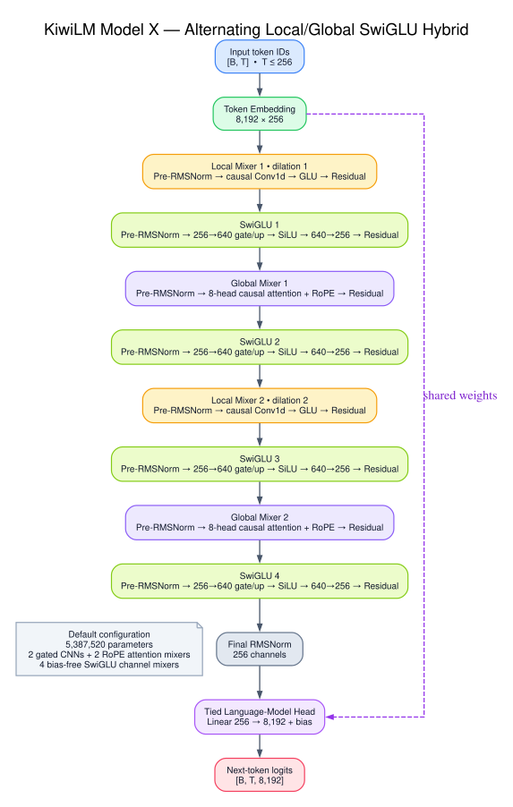

# KiwiLM

KiwiLM is a small PyTorch research project for comparing causal language-model
architectures on
[TinyStories](https://huggingface.co/datasets/roneneldan/TinyStories). The
current work focuses on two parameter-matched candidates:

| Model | Architecture | Parameters |
| --- | --- | ---: |
| X | 2 gated CNN mixers, 2 attention mixers, 4 SwiGLU FFNs | 5,387,520 |
| Y | 4 attention mixers, 4 SwiGLU FFNs | 5,372,160 |

Both use 256-wide embeddings, pre-RMSNorm residual paths, RoPE causal
self-attention, bias-free SwiGLU projections, a final RMSNorm, and tied
token/LM-head weights. They share the tokenizer, prepared-data format,
token-counted trainer, evaluation, checkpoint, streaming-generation, and
KV-cache implementations.

Models A–G, the portable Mamba experiment, and the original GPT-style baseline
remain available in the
[legacy models package](src/kiwilm/models/legacy/README.md).

## Active architectures

### Model X

Model X alternates inexpensive local mixing with content-dependent global
mixing:

```text
Embedding
  -> gated CNN (dilation 1) -> SwiGLU
  -> RoPE causal attention  -> SwiGLU
  -> gated CNN (dilation 2) -> SwiGLU
  -> RoPE causal attention  -> SwiGLU
  -> final RMSNorm -> tied LM head
```

It has two quadratic attention layers. In the matched smoke benchmark it
trained and generated substantially faster than Model Y while giving up some
validation quality.



### Model Y

Model Y is the modern Transformer control:

```text
Embedding
  -> 4 x [
       pre-RMSNorm RoPE causal attention
       pre-RMSNorm SwiGLU
     ]
  -> final RMSNorm -> tied LM head
```

Its 720-wide SwiGLUs keep it within 0.3% of Model X's parameter count. Model Y
replaces Model X's two gated convolutions with two additional attention
mixers, isolating the quality/throughput effect of the sequence mixer.

The architecture identifier is `model_y`. Checkpoints produced under the
temporary `modern_transformer` name still load and are normalized to Model Y
during reconstruction.

## Setup

KiwiLM uses [uv](https://docs.astral.sh/uv/) for dependency management:

```bash
uv sync
uv run kiwilm --help
```

With `--device auto`, training selects CUDA first, Apple MPS second, and CPU
otherwise. Select CUDA explicitly with `--device cuda`. FP16 training is
enabled with `--precision fp16`.

## Dataset profiles

The smoke and 750k datasets are separate prepared datasets with different
tokenizers and fingerprints. A checkpoint must always be evaluated and
generated with the dataset that prepared its tokenizer.

The verified prepared artifacts resolve to this TinyStories revision:

```text
f54c09fd23315a6f9c86f9dc80f725de7d8f9c64
```

Prepared directories are content-addressed and are not overwritten
automatically. Use `--force` only when intentionally rebuilding a directory.
The smoke and historical 550k fingerprints record `main` as the requested
revision, so their commands state `--revision main` explicitly and the resolved
revision must be checked before training. The derived 750k corpus pins the
immutable revision directly.

### Smoke dataset: 25k training stories

Prepare exactly 25,000 training stories and 2,000 validation stories:

```bash
uv run kiwilm prepare \
  --output-dir data/tinystories \
  --revision main \
  --train-limit 25000 \
  --validation-limit 2000 \
  --vocab-size 8192 \
  --min-frequency 2
```

Expected metadata:

| Field | Value |
| --- | --- |
| Training stories | 25,000 |
| Validation stories | 2,000 |
| Vocabulary | 8,192 |
| Fingerprint | `a01d7037441e4cc0f1fe48615d384761c47cea506101708bbe42a0cee8ec7418` |

The controlled smoke benchmark retrains X and Y from scratch for 2,000 packed
steps and 16,384,000 targets each:

```bash
uv run python scripts/run_model_xy_smoke_benchmark.py \
  --device auto
```

Results are written under:

```text
runs/benchmarks/model-xy-smoke/
  model-x/
  model-y/
  comparison/report.md
  comparison/results.jsonl
  summary.json
```

The runner refuses to overwrite a non-empty output directory.

For a 4 GB Windows CUDA GPU, retain the same effective batch and exact target
count with FP16 microbatches:

```powershell
uv run --no-sync python scripts/run_model_xy_smoke_benchmark.py `
  --device cuda `
  --precision fp16 `
  --batch-size 8 `
  --grad-accum-steps 4
```

### Full comparison dataset: 750k training stories

The 750k dataset deliberately reuses the tokenizer trained for the historical
550k corpus. This freezes token bytes and IDs across the full Model E/F/B/X/Y
comparison.

If `data/tinystories-550k` is not already present, prepare the tokenizer source:

```bash
uv run kiwilm prepare \
  --output-dir data/tinystories-550k \
  --revision main \
  --train-limit 550000 \
  --validation-limit 10000 \
  --vocab-size 8192 \
  --min-frequency 2
```

Before continuing, check `data/tinystories-550k/metadata.json`:

| Field | Expected value |
| --- | --- |
| Resolved revision | `f54c09fd23315a6f9c86f9dc80f725de7d8f9c64` |
| Dataset fingerprint | `d2f500e2a85cf7c1a1c1b292b2f186c04782e9443312aaea5f1dc08a561dc764` |
| Tokenizer SHA-256 | `0127391ca334542dd206b0bef735b571d3739e5a399e89bbe0b42e79a09d9226` |

Now prepare the pinned 750k corpus by reusing that tokenizer:

```bash
uv run kiwilm prepare \
  --output-dir data/tinystories-750k \
  --revision f54c09fd23315a6f9c86f9dc80f725de7d8f9c64 \
  --train-limit 750000 \
  --validation-limit 10000 \
  --tokenizer-from data/tinystories-550k
```

Expected 750k metadata:

| Field | Value |
| --- | --- |
| Training stories | 750,000 |
| Validation stories | 10,000 |
| Training tokens | 167,114,470 |
| Validation tokens | 2,021,315 |
| Tokenizer SHA-256 | `0127391ca334542dd206b0bef735b571d3739e5a399e89bbe0b42e79a09d9226` |
| Fingerprint | `6b2687870c402c5e70e677e8a6c88bb854786c8dcb963f9c734feb022862ed82` |

Preparation copies the tokenizer byte-for-byte and records content hashes
rather than machine-specific source paths.

## Train Models X and Y on 750k

Use the same 160,465,920-target budget, warmup, story-safe batching, seed, and
validation schedule for both models. This is a matched-data, matched-token
comparison; it gives each model about 29.8 targets per parameter.

Model X:

```bash
uv run kiwilm train \
  --architecture model_x \
  --data-dir data/tinystories-750k \
  --output-dir runs/model-x-750k \
  --device cuda \
  --batch-mode story \
  --precision fp16 \
  --max-tokens 160465920 \
  --warmup-tokens 8023296 \
  --max-steps 17000 \
  --batch-size 64 \
  --eval-mode both \
  --eval-interval 500 \
  --eval-batches 50 \
  --checkpoint-interval 500 \
  --log-interval 10 \
  --seed 42
```

Model Y:

```bash
uv run kiwilm train \
  --architecture model_y \
  --data-dir data/tinystories-750k \
  --output-dir runs/model-y-750k \
  --device cuda \
  --batch-mode story \
  --precision fp16 \
  --max-tokens 160465920 \
  --warmup-tokens 8023296 \
  --max-steps 17000 \
  --batch-size 64 \
  --eval-mode both \
  --eval-interval 500 \
  --eval-batches 50 \
  --checkpoint-interval 500 \
  --log-interval 10 \
  --seed 42
```

Story batching never crosses story boundaries. Padding targets use `-100` and
do not count toward the token budget, loss denominator, or valid-token
throughput. With `--eval-mode both`, story-safe validation selects the best
checkpoint and packed validation is reported as a secondary metric.

## Evaluate and generate

Evaluate story-safe validation:

```bash
uv run kiwilm evaluate \
  --data-dir data/tinystories-750k \
  --checkpoint runs/model-y-750k/best.pt \
  --batch-mode story \
  --batches 50 \
  --precision fp16 \
  --device auto
```

Repeat with `--batch-mode packed` for the secondary packed metric.

Generate with streaming and automatic KV caching:

```bash
uv run kiwilm generate \
  --data-dir data/tinystories-750k \
  --checkpoint runs/model-y-750k/best.pt \
  --prompt "Once upon a time" \
  --max-new-tokens 160 \
  --temperature 0.8 \
  --top-k 40 \
  --seed 42 \
  --cache auto \
  --stream
```

Use `--cache off` for historical comparison reports or on hardware where the
short-context cache overhead exceeds the saved computation.

## Repository layout

```text
src/kiwilm/
  models/
    attention.py       shared RoPE/SDPA attention
    model_x.py         active hybrid
    model_y.py         active modern Transformer
    legacy/            Models A-G, Mamba, and GPT baseline
  data.py              TinyStories preparation and batching
  training.py          packed/story-safe token-counted training
  generation.py        cached and streaming autoregressive generation
scripts/
  run_model_xy_smoke_benchmark.py
eval/
  story-consistency-prompts.json
```

Checkpoints contain the model and optimizer state, model/training
configuration, data fingerprint, sampler state, random states, token count,
and AMP scaler where applicable. Resume rejects incompatible architecture,
data, optimizer, sampler, or schedule settings.

## Verification

```bash
uv run ruff check .
uv run pytest -q
uv lock --check
```
