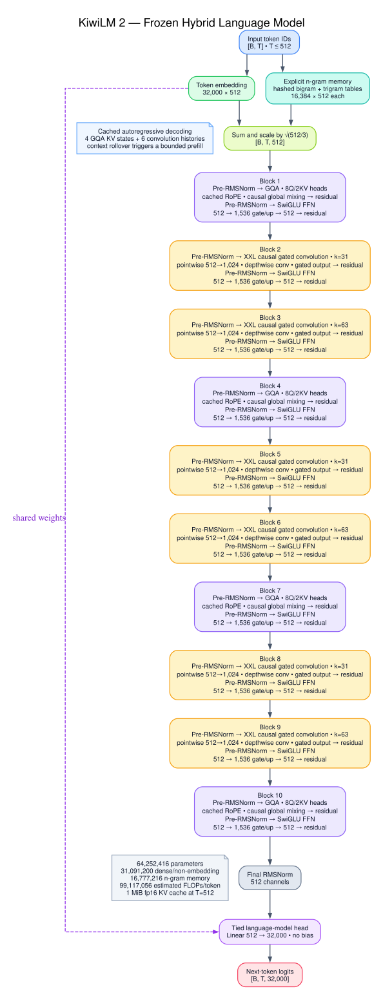
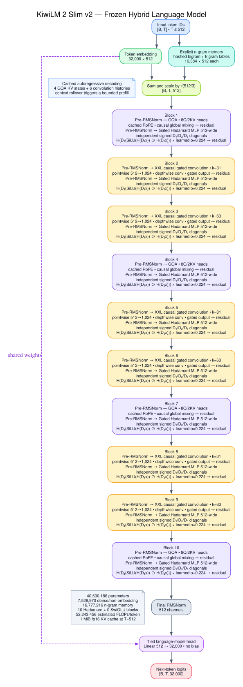

# KiwiLM 2 experiment runbook

Historical KiwiLM architectures, checkpoints, launchers, and reports live on
the `legacy` branch. The `master` branch supports only `kiwilm2` and
`kiwilm2_slim` while retaining the generic preparation, CPT, SFT, evaluation,
comparison, retrieval, and export workflows.

KiwiLM 2 is a controlled architecture experiment, not a continuation of the
earlier 5M-parameter TinyStories ranking. Both variants use this frozen stack:

```text
32K token embedding + hashed bigram/trigram embeddings
  -> GQA -> Conv31 -> Conv63
  -> GQA -> Conv31 -> Conv63
  -> GQA -> Conv31 -> Conv63
  -> GQA
  -> final RMSNorm -> tied LM head
```

Every mixer is followed by a second pre-RMSNorm residual branch. `kiwilm2`
uses a 1536-wide SwiGLU on that branch. New `kiwilm2_slim` runs use gated Slim
v2:

```text
a = H(x ⊙ d₁ + b₁)
b = H(x ⊙ d₂ + b₂)
y = H((SiLU(a) ⊙ b) ⊙ d₃ + b₃) × α
```

Each block owns a learned scalar `α` initialized to `1/sqrt(20) ≈ 0.2236`.
The three learned diagonal scales start as independent Rademacher vectors
(`±1` with equal probability), which keeps the two branches distinct and
prevents a positive gate product from concentrating in the FWHT DC channel;
all diagonal biases start at zero.
Serialized Slim configs record `hadamard_variant=gated_v2`; old configs without
the field load as `minimal_v1`, preserving the original negative-baseline
checkpoint shape. Slim remains intentionally unmatched in depth and parameters.

## Architecture diagrams

The diagrams are generated from the frozen Python configurations with
`uv run python scripts/render_kiwilm2_graphviz.py`.

### KiwiLM 2



### KiwiLM 2 Slim



The shared defaults are context 512, width 512, 8 query heads, 2 KV heads,
cached RoPE on GQA only, six causal depthwise kernels `31/63/31/63/31/63`, no
dropout, tied embeddings, and 16,384 buckets for each n-gram order. The
n-gram hash at position `t` uses only tokens at or before `t`.

## Frozen default accounting

| Variant | Total params | Dense/non-embedding | Token embedding | N-gram tables | Estimated FLOPs/token at 512 |
| --- | ---: | ---: | ---: | ---: | ---: |
| KiwiLM 2 | 64,252,416 | 31,091,200 | 16,384,000 | 16,777,216 | 99,117,056 |
| KiwiLM 2 Slim gated v2 | 40,690,186 | 7,528,970 | 16,384,000 | 16,777,216 | 52,243,456 |

Both variants use 1,048,576 bytes of fp16 KV cache per sequence at context
512. FLOPs are a static estimate with multiply-add counted as two operations;
hashing, lookups, norms, and activation-function internals are omitted. The
gated Slim estimate includes three affine diagonals and the gate product.
Reproduce the report:

```bash
uv run kiwilm profile-kiwilm2 --architecture kiwilm2
uv run kiwilm profile-kiwilm2 --architecture kiwilm2_slim
```

## Prepare the controlled corpus

The data recipe streams only the `fineweb-edu-dedup` and `cosmopedia-v2`
configs of `HuggingFaceTB/smollm-corpus`. It resolves `main` to an immutable
dataset SHA, reserves a disjoint prefix from both sources for validation, and
mixes the remaining streams with a seeded 70/30 schedule. Python-Edu is not
loaded. Packed split sizes are exact token counts, including a deterministic
truncation of the last document.

Train the 32K byte-level BPE once on the smoke source, then reuse it for every
larger subset:

```bash
uv run kiwilm prepare-smollm \
  --profile smoke \
  --output-dir data/smollm-smoke

uv run kiwilm prepare-smollm \
  --profile architecture \
  --tokenizer-from data/smollm-smoke \
  --output-dir data/smollm-architecture

uv run kiwilm prepare-smollm \
  --profile final-500m \
  --tokenizer-from data/smollm-smoke \
  --output-dir data/smollm-final-500m
```

Profiles contain 50M, 250M, 500M, or 1B training tokens plus 2M validation
tokens. Use `--train-tokens 25000000` for the lower 25M smoke boundary. Larger
profiles reject a missing `--tokenizer-from` to prevent accidental tokenizer
drift.

## Run the comparisons

The phase runner reconstructs the prepared data independently with the same
seed for each candidate. Token budget, batches, data order, schedule,
tokenizer, and context are therefore identical. It writes checkpoints,
JSONL metrics, samples, per-run profiles, and one `experiment.json` manifest.
The manifest also records a post-training health batch with every mixer/MLP
activation RMS and gradient norm plus n-gram hash occupancy and table gradients.

```bash
uv run python scripts/run_kiwilm2_experiment.py \
  --phase smoke \
  --data-dir data/smollm-smoke \
  --output-dir runs/kiwilm2-smoke \
  --device cuda \
  --precision bf16

uv run python scripts/run_kiwilm2_experiment.py \
  --phase architecture \
  --data-dir data/smollm-architecture \
  --output-dir runs/kiwilm2-architecture \
  --device cuda \
  --precision bf16
```

The smoke phase is an implementation/stability gate only. Do not select the
winner from it. Metrics include validation loss/perplexity, valid and model
tokens/second, padding fraction, current accelerator memory, and peak memory in
the final summary. Cached decoding is tested against uncached decoding across
the context rollover boundary.

The updated 200-batch smoke comparison measured gated Slim v2 at 4.9836 loss
versus Dense at 4.6904. Slim passed the health gate and the downloaded training
logs showed a 20% throughput advantage, so the selected 250M experiment retains
both candidates. The health gate requires finite activations and gradients,
nonzero mixer/MLP gradients in every block, no MLP residual RMS jump above 1.5x,
a deepest/first MLP-gradient ratio of at least 0.10, and learned residual scales
whose absolute values remain at most 1.

After both AdamW baselines, run the optional KiwiLM 2-only Muon sweep:

```bash
uv run python scripts/run_kiwilm2_experiment.py \
  --phase smoke \
  --data-dir data/smollm-smoke \
  --output-dir runs/kiwilm2-smoke-muon \
  --device cuda \
  --precision bf16 \
  --muon-lrs 0.01 0.02 0.04
```

Muon receives untied dense 2D `Linear.weight` matrices. AdamW receives token
and n-gram embeddings, tied LM-head storage, norms, biases, Hadamard diagonals,
and all depthwise convolution kernels. Only promote Muon if its validation
curve reaches a target loss in fewer tokens than AdamW.

## Colab launchers

The Colab launchers require the `colab` CLI, but they do not require prepared
local data. Authenticate the CLI before launching a billable GPU session:

```bash
uv tool install google-colab-cli
gcloud auth application-default login \
  --scopes=openid,https://www.googleapis.com/auth/cloud-platform,https://www.googleapis.com/auth/userinfo.email,https://www.googleapis.com/auth/colaboratory
colab sessions
```

Run both AdamW smoke candidates sequentially on fresh T4 sessions:

```bash
scripts/run_colab_kiwilm2_smoke.sh
```

Run only the gated Slim v2 smoke without repeating Dense training:

```bash
scripts/run_colab_kiwilm2_slim_smoke.sh
```

The Slim launcher defaults to `KIWILM2_COMPILE_POLICY=auto`. It performs three
warm-up and ten measured full-model forward/backward iterations for Dense eager,
Slim eager, and Slim compiled on the same VM. Compilation is selected only when
numerically compatible, faster than Slim eager, and faster than Dense eager;
otherwise the 50M run continues eagerly. The benchmark and the 5% promotion
speed gate are recorded in `summary.json`.

Run the controlled 250M-token pair:

```bash
scripts/run_colab_kiwilm2_architecture.sh
```

Architecture and final Colab jobs use 200 fixed validation batches instead of
the 50-batch smoke setting. With batch 8, accumulation 4, and context 512, the
250M job records a 15,359-step safety ceiling and stops exactly at the token
budget. Dense runs eagerly; Slim benchmarks eager and compiled execution on its
VM and selects the compatible faster path.

On Windows PowerShell, first prepare the 250M split with the frozen smoke
tokenizer:

```powershell
uv run kiwilm prepare-smollm `
  --profile architecture `
  --tokenizer-from "data\smollm-smoke" `
  --output-dir "data\smollm-architecture"
```

Then run both candidates sequentially with derived step and validation defaults:

```powershell
uv run python scripts\run_kiwilm2_experiment.py `
  --phase architecture `
  --data-dir "data\smollm-architecture" `
  --output-dir "runs\kiwilm2-architecture" `
  --device cuda `
  --precision bf16 `
  --batch-size 8 `
  --grad-accum-steps 4 `
  --slim-compile-mode compiled `
  --resume-existing
```

The phase runner derives `--max-steps 15359`, `--max-tokens 250000000`,
`--warmup-tokens 5000000`, and `--eval-batches 200`. Omit
`--slim-compile-mode compiled` if that Windows/PyTorch installation did not
successfully compile the 50M Slim run; eager mode is slower but checkpoint
compatible. `--resume-existing` is safe on the first invocation and resumes
each candidate from its own `latest.pt` after an interruption.

Run the dense KiwiLM 2 Muon sweep at `0.01 / 0.02 / 0.04`:

```bash
KIWILM2_PHASE=smoke scripts/run_colab_kiwilm2_muon_sweep.sh
```

For one customized job, use the generic launcher:

```bash
KIWILM2_PHASE=smoke \
KIWILM2_VARIANT=kiwilm2 \
KIWILM2_OPTIMIZER=adamw \
COLAB_GPU=L4 \
scripts/run_colab_kiwilm2.sh
```

Useful overrides are `KIWILM2_BATCH_SIZE`, `KIWILM2_GRAD_ACCUM_STEPS`,
`KIWILM2_PRECISION`, `COLAB_TIMEOUT_SECONDS`, `COLAB_SESSION_NAME`, and
`KIWILM_RESULT_DIR`. T4 and fp16 are the defaults.

After allocating the VM, the launcher opens the interactive Google Drive mount
flow. Complete that prompt once for each fresh Colab session. The remote worker
then streams FineWeb-Edu and Cosmopedia directly in the VM, resolves the dataset
revision, prepares exact packed splits, and validates the fingerprint, source
mix, Python-Edu exclusion, 32K tokenizer, and token budget before training.

By default, persistent files live below `My Drive/KiwiLM2`:

```text
KiwiLM2/
  tokenizer/                 shared frozen tokenizer bundle
  data/<phase>-<tokens>-seed<seed>/  complete prepared-data cache
  checkpoints/<run-key>/     latest.pt, best.pt, metrics, job, summary
```

The first candidate prepares and caches its phase data; later candidates copy
the same cache to fast VM-local storage. Checkpoint folders include a hash of
all resume-locked settings, preventing an incompatible automatic resume. While
training, each atomically completed local checkpoint is mirrored to Drive by a
background worker. Relaunching the same job automatically restores `latest.pt`,
`best.pt`, and `metrics.jsonl` from that folder.

Set `KIWILM2_DRIVE_ROOT=/content/drive/MyDrive/SomeFolder` to use another Drive
folder. Set `KIWILM2_DRIVE_BACKUPS=0` to skip mounting and persistence; data is
still prepared in the VM, but separate candidates will each prepare it again
and interrupted sessions will only have the launcher's emergency download.

Every job builds and uploads the current wheel, prepares or restores data,
trains one candidate, records the model profile and block/n-gram health report,
downloads checksummed artifact chunks, and stops the Colab session through an
exit trap. A successful local result contains `latest.pt`, `best.pt`,
`metrics.jsonl`, `summary.json`, and the exact `job.json`.

To resume a recovered or previous run with its original locked configuration:

```bash
KIWILM2_PHASE=smoke \
KIWILM2_VARIANT=kiwilm2 \
KIWILM2_RESUME_FROM=runs/colab/kiwilm2-smoke/kiwilm2-adamw/latest.pt \
scripts/run_colab_kiwilm2.sh
```

An explicit `KIWILM2_RESUME_FROM` takes precedence over the automatic Drive
resume. When `best.pt` and `metrics.jsonl` are beside that checkpoint, the
launcher uploads them too. If execution is interrupted before artifact packing,
the exit trap attempts to download `emergency-latest.pt`, `emergency-best.pt`,
and `emergency-metrics.jsonl` before releasing the VM; the last completed
periodic checkpoint should also remain in Drive.

## External evaluation

Prepare TinyStories and SimpleStories with the frozen SmolLM tokenizer, then
opt into cross-dataset evaluation explicitly:

```bash
uv run kiwilm prepare \
  --output-dir data/tinystories-kiwilm2-eval \
  --tokenizer-from data/smollm-smoke \
  --vocab-size 32000

uv run kiwilm prepare-simplestories \
  --output-dir data/simplestories-kiwilm2-eval \
  --tokenizer-from data/smollm-smoke \
  --vocab-size 32000

uv run kiwilm evaluate \
  --data-dir data/tinystories-kiwilm2-eval \
  --checkpoint runs/kiwilm2-architecture/kiwilm2-adamw/best.pt \
  --allow-data-mismatch
```

Run the 512-token counterfactual retrieval suite with the checkpoint's own
SmolLM prepared-data fingerprint. Its distances are 32, 128, 256, 384, and 448;
write gated-v2 results separately from the retained 256-token v1 evidence:

```bash
uv run python scripts/evaluate_context_retrieval.py \
  --data-dir data/smollm-architecture \
  --context-length 512 \
  --checkpoint runs/kiwilm2-architecture/kiwilm2-adamw/best.pt \
  --checkpoint runs/kiwilm2-architecture/kiwilm2-slim-gated-v2-adamw/best.pt \
  --label KiwiLM-2 \
  --label KiwiLM-2-Slim \
  --output-dir runs/kiwilm2-architecture/retrieval-gated-v2-512
```

General side-by-side generation remains available through `kiwilm compare`.
Keep mHC and dynamic routing out of these configs so all 2.0 checkpoints retain
the fixed experimental meaning.
