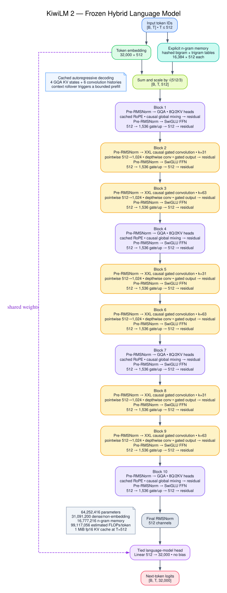
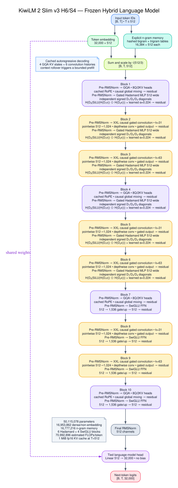

# KiwiLM 2 maintained reference

KiwiLM 2 is concluded. Its model/config/checkpoint interfaces remain supported
so future encoder experiments can compare against the frozen causal baseline.
No model math, state-dict keys, tokenizer or checkpoint format changed in cleanup.

## Architecture

All three V2 configurations share width 512, context 512, tied token embedding /
LM head, pre-RMSNorm blocks, hashed bigram/trigram memory, and the fixed mixer
schedule `GQA → Conv31 → Conv63` repeated three times, then final GQA.
Attention uses 8 query / 2 KV heads with cached RoPE; convolutions are causal.

- `kiwilm2`: all ten FFNs are width-1536 SwiGLUs; released Dense 1B reference.
- `kiwilm2_slim`: all-Hadamard control, including historical minimal-v1 loading.
- `kiwilm2_slim_v3`: lower gated Hadamard / upper SwiGLU V2 ablation, including
  historical H7/S3 and optional bounded SwiGLU residual gates. Not KiwiLM 3.

## Maintained interfaces

`ModelConfig.from_dict`, `build_model`, `load_trained_model` and the
Safetensors/Hub loaders still reconstruct V2 without training data. Cached
generation retains direct and 512-token rollover checks. Training/resume and
evaluation retain strict configuration and data-fingerprint validation.

Generic CLI workflows remain: SmolLM/TinyStories/SimpleStories/instruction data
preparation, causal train/resume, CPT, SFT, evaluate, generate, compare, retrieval,
instruction scoring and reporting, profiling, and tokenizer/Safetensors export.

Use `uv run --locked kiwilm <command> --help` for the maintained local interfaces.
Architecture diagrams can still be regenerated with
`uv run --locked python scripts/render_kiwilm2_graphviz.py`.

## Results and reproduction

- [Final 1B analysis](../examples/comparisons/kiwilm2-final-1b-tpu-muon/analysis.md)
- [All preserved comparisons](../examples/comparisons/)
- [Published model card](../releases/kiwilm2-1b/README.md)
- [Source/checkpoint freeze and regression commands](kiwilm2-freeze.md)
- [Historical complete architecture/experiment runbook](../archive/kiwilm2/docs/kiwilm2.md)
- [Historical Colab GPU/TPU workflows](../archive/kiwilm2/README.md)

The archived CLI workflows are not the future notebook-first V3 interface.
