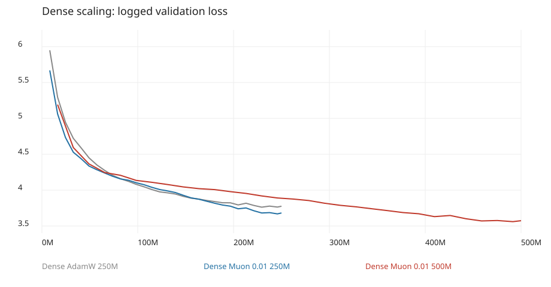

# Dense Muon 0.01: 500M-token scaling comparison

## Verdict

**500M improves held-out language modeling and remains healthy, but does not
solve repetitive generation or long-distance retrieval.** Keep this exact-500M
checkpoint as the leading Dense loss baseline. Do not interpret it as a clean
all-metrics win or assume that another doubling will fix generation quality.

All three checkpoints were freshly evaluated, rather than combining old and new
evaluation results. The primary comparison is Muon 0.01 at 250M versus 500M;
AdamW 250M is a secondary reference, not an equal-budget optimizer control.

## Validation

| Metric | AdamW 250M | Muon 0.01 250M | Muon 0.01 500M |
| --- | ---: | ---: | ---: |
| Fixed FP32 validation loss | 3.7425 | 3.6459 | **3.5369** |
| Fixed validation perplexity | 42.20 | 38.32 | **34.36** |
| Logged final validation loss | 3.7757 | 3.6820 | **3.5739** |
| Logged final perplexity | 43.63 | 39.73 | **35.65** |
| Exact training tokens | 250,000,000 | 250,000,000 | 500,000,000 |

Doubling Muon's training budget improves aligned loss by **0.1090** and reduces
perplexity by **10.3%**. Relative to AdamW 250M, loss improves by 0.2056, but that
comparison combines optimizer and budget effects.

The fixed evaluation uses the same 200 batches, batch size 2, context 512,
204,800 target positions, CPU sampling generator seed 143, and FP32 on local
MPS for every checkpoint. These are sampled windows, not an exhaustive sweep
of all two million validation tokens. Logged training validation used different
random windows and precision; it must not be mixed with the fixed figures.

The 500M `latest.pt` is step **30,518**, exactly **500,000,000 tokens**.
`best.pt` is step 30,000 / 491,520,000 tokens, with logged loss 3.5610 and PPL
35.20. Only `latest.pt` was evaluated here. The final 0.0129 logged increase
over best is too small, with changing validation windows, to establish
overfitting or prove that `best.pt` generalizes better.



The longer run does not reach intermediate loss thresholds faster: logged loss
3.8 first appears at 311.30M tokens, versus 188.42M for Muon 250M. Loss 3.7 first
appears at 376.83M versus 229.38M. However, the 500M schedule doubles warmup
from 5M to 10M and decays over twice as many tokens. Evaluation cadence also
changes from 500 to 1,000 steps. This is not evidence of a broken resume or a
like-for-like sample-efficiency regression. The longer schedule ultimately
reaches loss levels the 250M run never reached: 3.65 at 409.60M and 3.6 at
458.75M, at logged evaluation resolution.

## Health and caching

100 matched validation batches: seeds 141 and 142, 50 batches each, batch 2,
context 512, FP32 MPS. Full per-batch reports and per-block distributions are
retained alongside [summary.json](summary.json).

| Metric | AdamW 250M | Muon 250M | Muon 500M |
| --- | ---: | ---: | ---: |
| Health batches passing | 86/100 | **100/100** | **100/100** |
| Finite activations and gradients | Yes | Yes | Yes |
| Nonzero gradients | Yes | Yes | Yes |
| Minimum deepest/first SwiGLU gradient ratio | 1.526 | 1.307 | 0.738 |
| Block-9 amplification median | 1.439 | 1.350 | **1.291** |
| Block-9 amplification p90 | 1.514 | 1.415 | **1.349** |
| Block-9 amplification maximum | 1.587 | 1.464 | **1.379** |
| Block-9 batches above 1.5 | 14 | 0 | **0** |
| Direct and rollover cache parity | Pass | Pass | Pass |

There is no reproduced residual-growth problem in Dense Muon 500M. Its deepest
gradient is smaller relative to the first block than at 250M, but remains far
above the 0.1 guardrail across every tested batch. No residual-gate intervention
is justified by this audit. AdamW's 14 failures are threshold failures, not NaNs
or a training explosion. Cache parity is a separate single-sequence probe at
the full context boundary, with rtol/atol 0.002; it is not 100 parity trials.

## Generation: still the main weakness

An expanded five-seed test now supersedes the small seed-42 result for the main
behavioral conclusion. Across 120 samples per model, 500M has a mean repeated
four-gram rate of 0.3097 versus 0.3014 for Muon 250M. It is worse in 64 matched
positions, better in 51, and tied in five. Focused story repetition rises from
0.4634 to 0.4832. At the same time, 500M eliminates catastrophic single-word
collapse: zero samples contain a run of 20 repeated words, versus two for Muon
250M and six for AdamW. See the [extended five-seed analysis](extended-generation/analysis.md),
[all samples](extended-generation/samples.md), and
[machine summary](extended-generation/summary.json).

The original smaller test follows for reproducibility.

Six story-consistency prompts, focused and creative sampling, seed 42,
160-token maximum continuation, FP32 and cache disabled for all three models.
See [samples](generation-report.md), [raw rows](generation-results.jsonl), and
[suite](generation-suite.json).

| Metric | AdamW 250M | Muon 250M | Muon 500M |
| --- | ---: | ---: | ---: |
| Mean repeated-four-gram rate | **0.1938** | 0.2455 | 0.2616 |
| Longest consecutive identical-word run | **2** | 5 | **2** |

The 500M model has no single-word collapse in this suite, but sentence-level
loops remain severe. Focused object ownership repeats the blue-ball sentence
(four-gram rate 0.792); persistent goal loops on rabbits going to sleep (0.839);
dialogue/location loops on meeting here (0.777). These also fail the intended
object, goal, and location continuity qualitatively.

Creative samples generally repeat less, but introduce unrelated concepts,
pronoun changes, and semantic drift. More fluent surface text and lower loss
have not yielded reliable narrative state tracking. The overall repetition
increase is 0.0162, measured on just twelve samples per model and one seed;
do not call it a statistically established regression. A multi-seed suite and
broader non-story prompts are appropriate before a large follow-up run.

## Retrieval: mixed, not an aggregate improvement

The exact existing 512-context suite was reused: four candidates, five
distances, 32 counterfactual pairs per distance (160 pairs / 320 cases).
This is a small templated probe, not 320 independent general-reasoning tasks.

| Distance | AdamW accuracy | Muon 250M accuracy | Muon 500M accuracy |
| --- | ---: | ---: | ---: |
| 32 | 25.00% | **75.00%** | 50.00% |
| 128 | 25.00% | 62.50% | **68.75%** |
| 256 | 31.25% | 37.50% | **56.25%** |
| 384 | 25.00% | **31.25%** | **31.25%** |
| 448 | 25.00% | 25.00% | 25.00% |

| Aggregate | AdamW 250M | Muon 250M | Muon 500M |
| --- | ---: | ---: | ---: |
| Candidate accuracy | 26.25% | **46.25%** | **46.25%** |
| Paired-flip accuracy | 0.00% | **20.00%** | 18.75% |
| Mean contextual logit lift | 0.810 | 2.164 | **2.457** |
| Target vs best distractor margin | -0.446 | -0.269 | **-0.064** |

Mid-range retrieval improves and margins become less negative, but the
short-range regression cancels the aggregate accuracy gain. Distance 448
remains at four-way chance, with no paired-flip success. Lower validation loss
does not establish reliable use of the full 512-token context.
See the [retrieval report](retrieval/report.md).

## Provenance, efficiency, and limits

- All three serialize identical Dense architecture configurations: 64,252,416
  parameters, 31,091,200 non-embedding parameters, 16,777,216 n-gram parameters,
  approximately 99.12M estimated FLOPs/token, and 1 MiB attention KV cache at
  context 512 with two-byte elements. The FLOP estimate is not measured
  throughput; the KV figure excludes convolution and other cache storage.
- Shared seed 42, context 512, batch 8, accumulation 4, peak auxiliary AdamW LR
  0.0003, and Muon LR 0.01 for both Muon runs. The 500M run uses FP16 versus
  BF16 at 250M, and twice the warmup and decay horizon.
- Training fingerprints intentionally differ with prepared token budgets.
  The new job's tokenizer checksum matches the verified local tokenizer:
  `4bcfc2d969a7a8c2285b364d709917d14e17a141e281fed9d7770db00329acf3`.
  Every fresh evaluation uses local validation checksum
  `afc8a779d6d941584505c17318c24e56a6ac3e1e02b906beb33dcafb87be1e1c`.
  The 500M prepared metadata/data are not available locally, so its original
  split identity and training/validation separation were not independently
  re-audited. Cross-budget loading explicitly skips whole-training-fingerprint
  equality, not local data integrity verification. This is not an equal-data
  optimizer ablation.
- Checkpoint SHA-256 identities, full serialized configurations, token counts,
  and logged curves are preserved in the summary. Logged training steps are
  strictly increasing for all three inputs. That checks the provided log, not
  historical GPU executions or every resumption event.
- User reports training moved from Colab to Windows around step 11,000.
  The 500M median valid-token throughput is 18.76k for steps 500–10,999 and
  24.38k for steps 11,000–30,517. The approximate boundary is user-reported,
  not serialized hardware telemetry; the first segment includes interruptions.
  Do not combine them into an architecture speedup. Maximum logged allocated
  memory is 3.93 GB, not total device memory or a guaranteed global peak.
- No external TinyStories/SimpleStories loss datasets were available for this
  evaluation. Story prompts are qualitative transfer probes, not external loss
  benchmarks. No new training, TPU test, or 1B run was started.

## Next decision

Keep Dense Muon 0.01 unchanged as the strongest measured loss baseline.
Before committing to 1B, broaden multi-seed generation and retrieval testing
and set expectations: scaling helped prediction and stability, not every
behavioral metric. If 1B is pursued, make it an explicit scaling experiment
with a defined schedule and held-out-data provenance, not an assumed remedy
for repetition. No new architecture fix is supported by the residual audit.

## Reproduce

From the repository root with the three original checkpoints and prepared
architecture data in place:

```bash
python examples/comparisons/kiwilm2-final-500m-muon/evaluate.py
python examples/comparisons/kiwilm2-final-500m-muon/render.py
```

The evaluator uses MPS when available, otherwise CPU; all results in this
report were generated on MPS. It writes only comparison artifacts and never
trains. The narrative is manually reviewed; rerunning the scripts does not
automatically rewrite this analysis. Artifact scripts pass Ruff; 37 focused
comparison, retrieval, and KiwiLM 2 tests passed.
