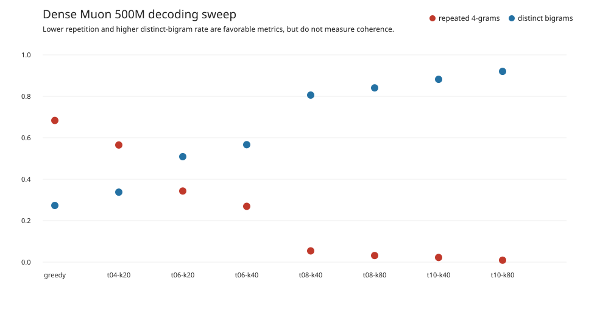

# Dense Muon 500M decoding sweep

## Verdict

Use **temperature 0.8, top-k 40** as the conservative default. Use **0.8/80**
when avoiding repetition matters more than staying close to high-probability
tokens. Do not use greedy or 0.4/20 for long generation. Temperature 1.0 lowers
repetition further, but the inspected outputs drift more and fabricate more
details; its automatic score is not a quality win.

The important result is that decoding substantially controls visible
degeneration, but cannot repair weak factual knowledge or state tracking.

## Setup

The exact Dense Muon 0.01 500M `latest.pt` checkpoint was tested on the same 12
prompts and seeds 42–46 as the extended generation comparison. Each profile has
60 samples, except that greedy has only 12 unique outputs repeated across the
five seed positions because sampling seeds do not affect greedy decoding.

Every continuation uses FP32 MPS, cache disabled, context 512, and a 160-token
cap. The evaluator verified the checkpoint SHA-256. The 0.4/20 and 0.8/40 rows
are exact reused samples; the other 360 outputs are new.

## Results

| Profile | Mean repeated 4-grams | Median | Severe loops >0.5 | Distinct words | Distinct bigrams | Max word run |
| --- | ---: | ---: | ---: | ---: | ---: | ---: |
| Greedy | 0.6835 | 0.8336 | 45/60* | 0.195 | 0.273 | 1 |
| 0.4 / k20 | 0.5651 | 0.6291 | 38/60 | 0.221 | 0.338 | 2 |
| 0.6 / k20 | 0.3431 | 0.3064 | 22/60 | 0.321 | 0.509 | 3 |
| 0.6 / k40 | 0.2692 | 0.2344 | 10/60 | 0.351 | 0.567 | 57 |
| **0.8 / k40** | **0.0543** | 0.0302 | 1/60 | 0.506 | 0.806 | **2** |
| 0.8 / k80 | 0.0318 | 0.0155 | **0/60** | 0.536 | 0.841 | 3 |
| 1.0 / k40 | 0.0225 | **0.0000** | **0/60** | 0.562 | 0.882 | 16 |
| 1.0 / k80 | **0.0094** | **0.0000** | **0/60** | **0.618** | **0.920** | 3 |

*Greedy's 45/60 represents nine of 12 unique prompts, repeated for seed-aligned
reporting. It is not 45 independent generations.

Increasing temperature has the dominant effect. At temperature 0.6, widening
top-k from 20 to 40 also helps: severe loops fall from 22 to 10. At temperature
0.8, widening top-k from 40 to 80 removes the sole severe loop and lowers mean
repetition by 41%. These are descriptive results on a fixed prompt set, not
population confidence estimates.

## Manual inspection

The automatic metrics measure repetition and lexical diversity—not truth,
coherence, or prompt adherence. Inspection of all prompt categories shows:

- Greedy and 0.4/20 repeatedly restate entire clauses, even though their
  maximum consecutive-word runs can look harmless.
- At 0.6/40, a named-entity sample collapses to `Dr.` for 57 tokens. Thus this
  setting still permits catastrophic failures despite better averages.
- At 0.8/40, repetition is usually controlled and output stays somewhat closer
  to common prose patterns. It remains semantically unreliable.
- At 0.8/80, outputs are more diverse, but examples invent historical events,
  confuse evaporation with condensation, and drift away from entity and
  ownership constraints.
- At 1.0, low repetition often accompanies stronger topic drift, invented
  terminology, non sequiturs, and broken procedures. The 1.0/40 maximum word
  run of 16 comes from repeated `T.` fragments in one story.

For example, none of the high-temperature profiles reliably completes the tea
procedure or explains binary storage and the water cycle correctly. This is a
model-capability limitation, not something to optimize away by selecting the
lowest repeated-four-gram score.

## Recommendation

Keep 0.8/40 as the primary evaluation profile so future results remain
comparable. Add 0.8/80 as an anti-repetition secondary profile. If a product
needs factual or procedural answers, decoding alone is insufficient; evaluate
continued pretraining/data quality or instruction tuning separately.

For a future 1B checkpoint, rerun this exact frozen sweep before changing the
default. A meaningful decoding improvement should reduce repetition without
increasing blinded human ratings of drift or incorrectness. The next stronger
test would therefore add a small, predefined human rubric for relevance,
coherence, factuality, and continuity—not more parameter combinations.

Artifacts:

- [Machine summary](summary.json)
- [All 480 rows](results.jsonl)
- [All generated text](samples.md)
- [Frozen sweep definition](suite.json)
